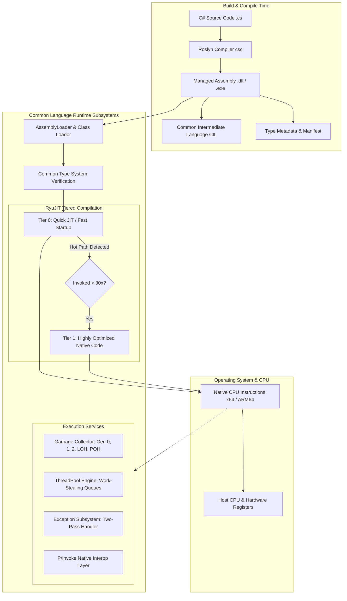
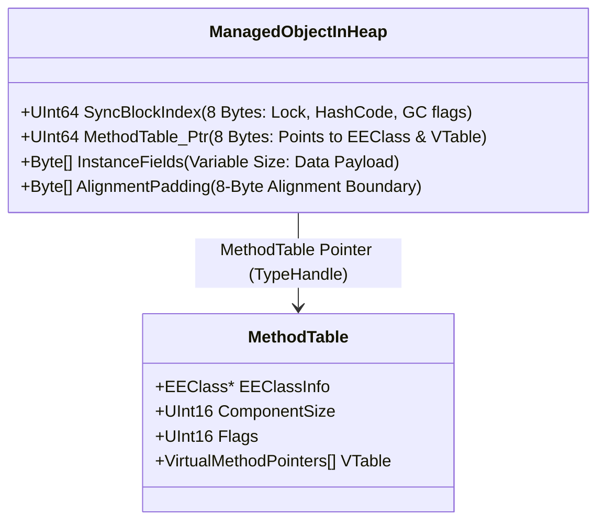

# Deep-Dive Guide: Common Language Runtime (CLR) Internals (Fully Paired Bilingual Guide)

---

## 1. English Definition & Concept
The **Common Language Runtime (CLR)** is the virtual execution engine and heart of the .NET ecosystem. The CLR manages the complete execution lifecycle of .NET applications.

Rather than compiling C# directly into native machine code (CPU opcodes), the C# compiler (Roslyn) compiles source code into a CPU-agnostic intermediate format called **Common Intermediate Language (CIL)** (formerly MSIL) paired with rich **Type Metadata**. At runtime, the CLR acts as a managed operating environment that loads assemblies, validates type safety, allocates memory, compiles CIL into optimized native machine code via **Just-In-Time (JIT)** compilation, coordinates thread scheduling, handles structured exceptions, and automatically reclaims unused memory via the **Garbage Collector (GC)**.

---

## 2. Bangla Explanation (বাংলায় সহজ ব্যাখ্যা)
সহজ ভাষায়, **Common Language Runtime (CLR)** হলো .NET ইকোসিস্টেমের **"হৃদপিণ্ড"** বা একটি ভার্চুয়াল এক্সিকিউশন অপারেটিং সিস্টেম। জাভা (Java) জগতে যেমন **JVM (Java Virtual Machine)** কাজ করে, C# এবং .NET জগতে ঠিক একই ভূমিকা পালন করে **CLR**।

আমরা যখন ভিজ্যুয়াল স্টুডিও বা কমান্ড লাইনে C# কোড কম্পাইল করি, তখন কোডটি সরাসরি কম্পিউটারের প্রসেসরের বোঝার উপযোগী মেশিন কোডে (Machine Code: 0 এবং 1) রূপান্তর হয় না। পরিবর্তে C# কম্পাইলার (Roslyn) কোডটিকে **CIL (Common Intermediate Language)** বা **MSIL** নামক একটি মধ্যবর্তী ফরম্যাটে এবং সাথে প্রচুর **Metadata** সহ একটি `.dll` বা `.exe` ফাইলে রূপান্তর করে। 

অ্যাপ্লিকেশনটি রান করার সময় আসল জাদুর কাজটি করে CLR:
1. এটি অ্যাসেম্বলি ফাইল লোড করে।
2. কোডের টাইপ সেফটি (Type Safety) ভেরিফাই করে।
3. **RyuJIT** কম্পাইলারের মাধ্যমে CIL কোডকে তাৎক্ষণিকভাবে কম্পিউটারের প্রসেসরের আসল মেশিন কোডে রূপান্তর করে।
4. মেমোরি ম্যানেজমেন্ট (Heap, Stack, Garbage Collection), থ্রেড শিডিউলিং এবং এক্সেপশন নিয়ন্ত্রণের পুরো দায়িত্ব নিজের কাঁধে তুলে নেয়।

---

## 3. Why It Exists (কেন তৈরি করা হয়েছে?)

### English:
Before managed runtimes like the CLR, software development was dominated by unmanaged languages like C and C++. While offering raw execution speed, unmanaged software suffered from catastrophic architectural flaws:
1. **Manual Memory Catastrophes**: Developers had to manually allocate (`malloc`/`new`) and deallocate (`free`/`delete`) memory. Forgetting to free caused **Memory Leaks**; freeing prematurely caused **Dangling Pointers**; freeing twice caused **Double-Free Heap Corruption**; writing past boundaries created **Buffer Overflows** (the source of most security exploits).
2. **Language Isolation & Silos**: Code written in C++ could not easily talk to code written in Visual Basic or Pascal without fragile, manual binary wrappers (like COM/CORBA). Each language had distinct data type sizes, calling conventions, and incompatible runtime libraries.
3. **Platform & Hardware Lock-In**: Code compiled directly to targeting CPU architectures (x86, PowerPC). Porting to a new architecture required complete re-compilation and re-architecting platform-specific system calls.
4. **Lack of Runtime Introspection**: Binary executables lacked self-describing metadata. Dynamic reflection, runtime dependency injection, and automatic serialization were virtually impossible without massive boilerplate.

The .NET CLR was created to solve these challenges through a unified runtime architecture:
- **Automatic Memory Safety**: Zero manual pointer arithmetic required in typical code; the Garbage Collector eliminates leaks and dangling pointers.
- **Cross-Language Interoperability**: C#, F#, VB.NET, and C++/CLI compile down to the identical intermediate language (CIL) adhering to the **Common Type System (CTS)** and **Common Language Specification (CLS)**. A C# class can inherit from an F# record seamlessly.
- **Hardware Portability**: The same CIL binary executes on x64, ARM64, Windows, Linux, and macOS. The CLR's JIT compiler generates machine code optimized specifically for the host CPU at runtime.
- **Self-Describing Metadata**: Rich metadata embedded into every PE assembly empowers Reflection, Attribute-based programming, and dynamic code generation.

### বাংলায় কারণ:
CLR আসার পূর্বে সফটওয়্যার ডেভেলপমেন্টে C এবং C++ এর মতো আনম্যানেজড (Unmanaged) ল্যাঙ্গুয়েজ প্রধান ছিল। সেখানে কিছু ভয়াবহ কাঠামোগত সমস্যা ছিল:
1. **ম্যানুয়াল মেমোরি ম্যানেজমেন্টের দুঃস্বপ্ন**: মেমোরি নেওয়া এবং মোছার দায়িত্ব ছিল প্রোগ্রামারের। মেমোরি ডিলিট করতে ভুলে গেলে **Memory Leak** হতো, ভুল করে আগে ডিলিট করলে **Dangling Pointer** তৈরি হতো, আর মেমোরি বাউন্ডারি পার হয়ে গেলে **Buffer Overflow** হতো—যা ছিল হ্যাকিং ও সিস্টেম ক্র্যাশের প্রধান কারণ।
2. **ল্যাঙ্গুয়েজ কমিউনিকেশন সমস্যা**: অতীতে Visual Basic এ লেখা কোডের সাথে C++ এ লেখা কোডের যোগাযোগ করানো ছিল অত্যন্ত জটিল। প্রতিটা ল্যাঙ্গুয়েজের নিজস্ব ডাটা টাইপ ফরম্যাট ও মেমোরি সাইজ ছিল।
3. **হার্ডওয়্যার ডিপেনডেন্সি**: কোনো প্রোগ্রামের বাইনারি সরাসরি নির্দিষ্ট প্রসেসরের জন্য তৈরি হতো। এক প্রসেসরের কোড অন্য প্রসেসর বা ওএসে চালানো যেত না।
4. **মেটাডেটার অভাব**: বাইনারি কোডের নিজস্ব কোনো বিবরণ থাকত না; যার ফলে রানটাইমে রিফ্লেকশন, অবজেক্ট সিরিয়ালাইজেশন বা ডায়নামিক কোড ইন্সপেকশন করা দুঃসাধ্য ছিল।

মাইক্রোসফট এই সমস্যাগুলো সমূলে দূর করতে **CLR** তৈরি করে। এর ফলে:
- অটোমেটিক মেমোরি সেফটি নিশ্চিত হয় (Garbage Collector)।
- বিভিন্ন ভাষার মধ্যে অভিন্ন টাইপ সিস্টেম (CTS/CLS) প্রতিষ্ঠিত হয়—ফলে C# এ বসে F# বা VB.NET এর কোড সহজেই ব্যবহার করা যায়।
- একই ইন্টারমিডিয়েট কোড (CIL) উইন্ডোজ, লিনাক্স, ম্যাক, x64 বা ARM প্রসেসরে কোনো পরিবর্তন ছাড়াই রান করা যায়।

---

## 4. How It Works Under The Hood (অভ্যন্তরীণ মেকানিজম / Internals)

The CLR is a sophisticated multi-component subsystem operating directly between the .NET application code and the host Operating System / Hardware.

### The Complete Compilation & Execution Pipeline

```
[ C# Source Code (.cs) ]
           │
           ▼ (Compile Time: Roslyn Compiler `csc`)
[ Managed PE Assembly (.dll / .exe) ]
   ├── CIL / MSIL Bytecode (CPU-Agnostic Instructions)
   ├── Metadata Tables (Types, Methods, Fields, Attributes)
   └── Assembly Manifest (Dependencies, Identity, Versioning)
           │
           ▼ (Runtime Startup: `dotnet exec` / OS Process)
┌────────────────────────────────────────────────────────┐
│                   .NET CLR Engine                      │
│                                                        │
│  1. AssemblyLoadContext (Locates & loads dependencies) │
│  2. Class Loader & Type System (Resolves CTS/CLS)     │
│  3. Metadata Verifier (Guarantees type-safety)         │
│  4. RyuJIT Compiler (Tiered Compilation / OSR)         │
│     ├── Tier 0: Quick JIT (Fast startup, low opt)     │
│     └── Tier 1: Optimized JIT (Inlining, SIMD, Loops)  │
│  5. Execution Engine (Coordinates OS Threads & Stacks) │
│  6. Garbage Collector (SOH Gen 0/1/2, LOH, POH)       │
│  7. Exception Engine (Two-Pass SEH Stack Unwinding)    │
│  8. Interop Engine (P/Invoke to native OS C-APIs)      │
└────────────────────────────────────────────────────────┘
           │
           ▼
[ Native Machine Code (x64 / ARM64 Machine Opcodes) ]
           │
           ▼
[ CPU Execution & Hardware Registers ]
```

### Core Subsystems of the CLR

#### 1. CLI vs CLR vs CTS vs CLS
- **CLI (Common Language Infrastructure)**: The open international technical specification (ECMA-335 / ISO 23271) describing the runtime architecture, bytecode format, and type system.
- **CLR (Common Language Runtime)**: Microsoft's concrete, battle-tested implementation of the CLI for .NET.
- **CTS (Common Type System)**: The formal ruleset governing all data types supported by the CLR. It defines that `System.Int32` is identical whether written as `int` in C# or `Integer` in VB.NET. It strictly categorizes types into **Value Types** (allocated on Stack or inlined inside containing objects) and **Reference Types** (allocated on the Managed Heap).
- **CLS (Common Language Specification)**: A subset of CTS rules guaranteeing cross-language interoperability. If a library exposes only CLS-compliant APIs (e.g., avoiding `uint` or case-sensitive public identifiers), any .NET language can consume it without runtime errors.

#### 2. Just-In-Time (JIT) Compiler (RyuJIT & Tiered Compilation)
When a C# method is first called, it is not yet machine code. The MethodTable pointer points to a small stub called a **Precode / JIT Trampoline**.
- **First Call**: The stub jumps into the JIT compiler (`RyuJIT`). RyuJIT translates the method's CIL instructions into native CPU instructions, writes them into an executable memory page, and overwrites the trampoline stub with a direct jump (`jmp`) to that native code address.
- **Subsequent Calls**: All future invocations jump directly to the native machine code with zero JIT compilation overhead.
- **Modern Tiered Compilation (.NET Core 3.0 to .NET 8/9)**:
  - **Tier 0 (Quick JIT)**: Generates unoptimized machine code almost instantly with no loop unrolling or inlining. This ensures rapid application cold startup.
  - **Call Counter**: The CLR tracks how many times each method is invoked (e.g., 30+ invocations).
  - **Tier 1 (Optimized JIT)**: Methods identified as "hot paths" are queued to a background JIT compilation thread. RyuJIT re-compiles them with aggressive optimizations (dead-code elimination, SIMD vectorization, method devirtualization, aggressive inlining).
  - **On-Stack Replacement (OSR)**: Introduced in .NET 7, allows the CLR to replace a slow running method with its Tier 1 optimized version *while it is still executing inside a long-running loop* without waiting for the method to return.

#### 3. Object Memory Overhead in CLR (Managed Heap Internals)
Every reference type object allocated on the CLR Managed Heap has a mandatory **overhead layout**:
1. **SyncBlockIndex (Header)**:
   - Size: 4 bytes on 32-bit; **8 bytes on 64-bit**.
   - Contains bitflags for object hash code generation, monitor lock ownership (`lock(obj)` thin/fat locks), and finalizer queue registration.
2. **MethodTable Pointer (TypeHandle)**:
   - Size: 4 bytes on 32-bit; **8 bytes on 64-bit**.
   - Points directly to the type's `MethodTable` structure in the Loader Heap. This provides runtime type information, reflection data, and the virtual method dispatch table (vtable).
3. **Instance Fields Data**: The actual payload of the object's instance variables (aligned to CPU word boundaries).

> **Interview Fact**: On a 64-bit system, an empty object instance `new object()` takes **24 bytes** of heap memory! (8 bytes SyncBlockIndex + 8 bytes MethodTable Pointer + 8 bytes minimum padding alignment).

#### 4. The Two-Pass Exception Handling Model (SEH)
The CLR implements Structured Exception Handling using a **Two-Pass Model**:
1. **Pass 1 (Search / Filter Pass)**: When an exception is thrown (`throw`), the CLR walks up the call stack inspecting `catch` blocks and evaluating exception filters (`when (...)`). No `finally` blocks are executed during this pass. If no suitable handler is found, the process crashes without executing `finally` blocks, preserving the crash dump at the exact point of origin!
2. **Pass 2 (Unwind Pass)**: Once a matching handler is found, the CLR unwinds the call stack down to that handler, executing all intermediate `finally` blocks and cleanup routines sequentially.

### বাংলায় অভ্যন্তরীণ মেকানিজম:
1. **CIL ও মেটাডেটা**: C# কম্পাইলার কোডকে মেশিন কোড বানায় না; বানায় CIL বাইটকোড। এর সাথে থাকে মেটাডেটা টেবিল যা ক্লাসের সমস্ত ফিল্ড, মেথড এবং অ্যাট্রিবিউটের নিখুঁত বর্ণনা সংরক্ষণ করে।
2. **RyuJIT ও Tiered Compilation**:
   - অতীতে কোনো মেথড প্রথমবার কল হলে সম্পূর্ণ অপ্টিমাইজড করতে সময় বেশি লাগত (Cold Start Problem)।
   - আধুনিক .NET এ **Tiered Compilation** রয়েছে:
     - **Tier 0 (Quick JIT)**: অ্যাপ দ্রুত চালু করার জন্য কোনো অপ্টিমাইজেশন ছাড়াই দ্রুত মেশিন কোড বানায়।
     - **Tier 1**: যখন কোনো মেথড বারবার কল হয় (Hot Path), ব্যাকগ্রাউন্ড থ্রেড সেই মেথডকে ইনলাইনিং এবং লুপ অপ্টিমাইজেশন সহ শক্তিশালী হাই-পারফরম্যান্স কোডে রূপান্তর করে।
     - **OSR (On-Stack Replacement)**: মেথডের ভেতরে কোনো বিশাল লুপ চলতে থাকা অবস্থাতেই CLR মেথডটিকে রানিং অবস্থায় অপ্টিমাইজড ভার্সন দিয়ে রিপ্লেস করে ফেলতে পারে!
3. **হিপ মেমোরিতে অবজেক্টের ওভারহেড**:
   - ৬৪-বিট সিস্টেমে যেকোনো রেফারেন্স অবজেক্টের শুরুতে দুটি হিডেন ফিল্ড থাকে:
     1. **SyncBlockIndex (৮ বাইট)**: থ্রেড লকিং (`lock`), অবজেক্টের হ্যাশকোড ইত্যাদির তথ্য রাখে।
     2. **MethodTable Pointer (৮ বাইট)**: অবজেক্টের টাইপ ও মেথড টেবিলের অ্যাড্রেস নির্দেশ করে।
   - ফলে সম্পূর্ণ ফাঁকা একটি `new object()` ও মেমোরিতে **২৪ বাইট** (৮ + ৮ + ৮ বাইট প্যাডিং) জায়গা দখল করে।
4. **টু-পাস এক্সেপশন মডেল**: CLR এক্সেপশন হ্যান্ডেল করে দুই ধাপে। প্রথম ধাপে স্ট্যাক সার্চ করে দেখে কোনো `catch` বা `when` ফিল্টার মিলল কিনা। মিললে তবেই দ্বিতীয় ধাপে স্ট্যাক আনওয়াইন্ড (Unwind) করে পথিমধ্যে থাকা `finally` ব্লকগুলো এক্সিকিউট করে।

---

## 5. Built-in Types & Simple Example (বিল্ট-ইন টাইপ ও সহজ উদাহরণ)

### Core Built-in Types for Inspecting and Controlling the CLR

| Built-in Type / Namespace | Primary Responsibility | Key Members / APIs |
| :--- | :--- | :--- |
| **`System.GC`** | Directly queries and triggers Garbage Collector operations. | `GetTotalMemory()`, `GetGeneration()`, `Collect()`, `KeepAlive()`, `SuppressFinalize()` |
| **`System.Runtime.GCSettings`** | Inspects GC mode and controls heap latency behavior. | `IsServerGC`, `LatencyMode` (`Batch`, `Interactive`, `SustainedLowLatency`) |
| **`System.Runtime.CompilerServices.RuntimeHelpers`** | Low-level CLR runtime intrinsics for high-performance frameworks. | `PrepareMethod()`, `GetHashCode()`, `AllocateUninitializedArray()`, `OffsetToStringData` |
| **`System.Threading.ThreadPool`** | Manages CLR worker threads, work-stealing queues, and I/O completion ports. | `GetAvailableThreads()`, `GetMinThreads()`, `GetMaxThreads()`, `QueueUserWorkItem()` |
| **`System.Runtime.Loader.AssemblyLoadContext`** | Isolates, loads, and unloads assemblies dynamically in memory. | `Default`, `EnterContextualReflection()`, `Unload()` |
| **`System.Environment`** | Queries host environment, process architecture, and runtime version. | `Version`, `ProcessorCount`, `Is64BitProcess`, `CurrentManagedThreadId` |

#### বাংলায় বিল্ট-ইন টাইপসমূহের পরিচয়:
1. **`System.GC`**: CLR এর Garbage Collector কে সরাসরি মনিটর করা, মেমোরি কত বাইট খরচ হয়েছে তা দেখা এবং জেনারেশন ট্র্যাক করা।
2. **`System.Runtime.GCSettings`**: বর্তমান অ্যাপ্লিকেশন Workstation GC নাকি Server GC মোডে চলছে তা চেক করা এবং GC Latency কাস্টমাইজ করা।
3. **`System.Runtime.CompilerServices.RuntimeHelpers`**: রানটাইমের অত্যন্ত ডিপ ইন্টারনাল টুলস (যেমন কোনো মেথডকে আগে থেকেই JIT কম্পাইল করে প্রস্তুত রাখা, বা অবজেক্টের ট্রু হ্যাশকোড বের করা)।
4. **`System.Threading.ThreadPool`**: CLR এর ইন্টারনাল থ্রেডপুল মনিটর করা (কতগুলো থ্রেড খালি আছে, থ্রেডপুল ওভারলোড হচ্ছে কিনা)।
5. **`System.Environment`**: রানটাইমের সংস্করণ (.NET Core/8/9), কোর কাউন্ট ও প্রসেস আর্কিটেকচার জানা।

---

### Runnable C# Code Example: Inspecting CLR Internals

```csharp
using System;
using System.Diagnostics;
using System.Runtime;
using System.Runtime.CompilerServices;
using System.Threading;

namespace ClrInternalsDemo
{
    public class CustomerOrder
    {
        public int OrderId { get; set; }
        public decimal Amount { get; set; }
    }

    public static class Program
    {
        public static void Main()
        {
            Console.WriteLine("=================================================");
            Console.WriteLine("    .NET CLR RUNTIME INTROSPECTION & INTERNALS   ");
            Console.WriteLine("=================================================");

            // 1. Environment & CLR Engine Version
            Console.WriteLine($"\n[1] CLR & Process Environment:");
            Console.WriteLine($" - .NET CLR Version      : {Environment.Version}");
            Console.WriteLine($" - 64-Bit Process        : {Environment.Is64BitProcess}");
            Console.WriteLine($" - Logical CPU Cores     : {Environment.ProcessorCount}");
            Console.WriteLine($" - OS Architecture       : {Environment.OSVersion.Platform}");

            // 2. GC & Heap Configuration
            Console.WriteLine($"\n[2] Garbage Collector Subsystem:");
            Console.WriteLine($" - Is Server GC Enabled  : {GCSettings.IsServerGC} (True = Multi-heap Server GC; False = Workstation)");
            Console.WriteLine($" - GC Latency Mode       : {GCSettings.LatencyMode}");
            Console.WriteLine($" - Large Object Compact  : {GCSettings.LargeObjectHeapCompactionMode}");

            long memoryBefore = GC.GetTotalMemory(forceFullCollection: false);
            Console.WriteLine($" - Managed Heap Memory   : {memoryBefore:N0} bytes");

            // 3. Object Lifetime, Generation & Identity Hash
            Console.WriteLine($"\n[3] Object Lifetime & SyncBlock Identity:");
            var order = new CustomerOrder { OrderId = 101, Amount = 450.75m };

            // Generation tracking
            Console.WriteLine($" - Order Initial GC Gen  : Gen {GC.GetGeneration(order)}");

            // Identity hash code (stored in SyncBlockIndex header without overriding GetHashCode)
            int clrIdentityHash = RuntimeHelpers.GetHashCode(order);
            Console.WriteLine($" - CLR SyncBlock Identity Hash: {clrIdentityHash} (0x{clrIdentityHash:X})");

            // Force a Gen 0 collection to watch object promotion
            GC.Collect(0, GCCollectionMode.Forced);
            Console.WriteLine($" - Order Gen Post-GC 0   : Gen {GC.GetGeneration(order)} (Promoted!)");

            // Prevent GC from collecting object prematurely before this line
            GC.KeepAlive(order);

            // 4. ThreadPool Engine State
            Console.WriteLine($"\n[4] CLR ThreadPool Engine:");
            ThreadPool.GetAvailableThreads(out int workerAvailable, out int ioAvailable);
            ThreadPool.GetMinThreads(out int workerMin, out int ioMin);
            ThreadPool.GetMaxThreads(out int workerMax, out int ioMax);

            Console.WriteLine($" - Worker Threads        : Min={workerMin}, Available={workerAvailable}, Max={workerMax}");
            Console.WriteLine($" - I/O Completion Threads: Min={ioMin}, Available={ioAvailable}, Max={ioMax}");

            // 5. JIT Pre-Compilation (Eliminating Cold Start)
            Console.WriteLine($"\n[5] JIT Compiler / RuntimeHelpers:");
            RuntimeMethodHandle methodHandle = typeof(CustomerOrder).GetMethod("get_Amount")!.MethodHandle;
            
            // Forces RyuJIT to compile the method immediately to eliminate first-call penalty
            RuntimeHelpers.PrepareMethod(methodHandle);
            Console.WriteLine($" - CustomerOrder.get_Amount has been JIT-compiled ahead of execution.");

            Console.WriteLine("\n[DONE] CLR Demo executed successfully.");
        }
    }
}
```

---

## 6. Real-World Production Example (বাস্তব প্রোডাকশন উদাহরণ)

### Production Scenario: Zero Cold-Start & Low-Latency Trading / Microservice Engine

In mission-critical enterprise systems (e.g., Ultra-High Frequency Trading, Payment Processing Gateways, Real-Time Telemetry Ingestion), a latency spike on the **first request** or an unannounced **Garbage Collection pause** can cost millions of dollars.

To solve this, senior engineers configure and tune the CLR:
1. **Pre-JIT Critical Paths**: Pre-compile critical execution paths using `RuntimeHelpers.PrepareMethod` during container warm-up so the first incoming customer transaction executes instantly without RyuJIT compilation overhead.
2. **Temporary No-GC Critical Regions**: Use `GC.TryStartNoGCRegion` during critical transaction windows to guarantee zero Garbage Collection "Stop-The-World" pauses.
3. **ThreadPool Starvation Monitoring**: Monitor thread starvation using ThreadPool metrics to avoid sudden thread pool exhaustion.

```csharp
using System;
using System.Runtime;
using System.Runtime.CompilerServices;
using System.Threading;
using System.Threading.Tasks;

public record TradeRequest(string Ticker, int Quantity, decimal Price);

public class HighFrequencyTradingEngine
{
    private static readonly Action<TradeRequest> ExecuteTradeDelegate = ExecuteTradeCore;

    // Warm-up and pre-JIT critical methods during service initialization
    public static void WarmUpEngine()
    {
        Console.WriteLine("[STARTUP] Pre-JIT compiling critical execution paths...");

        // Force RyuJIT to compile the method before live traffic arrives
        RuntimeHelpers.PrepareMethod(ExecuteTradeDelegate.Method.MethodHandle);

        // Pre-allocate thread pool workers to prevent thread injection delays (1 thread per 500ms)
        ThreadPool.SetMinThreads(Environment.ProcessorCount * 4, Environment.ProcessorCount * 4);

        Console.WriteLine("[STARTUP] Engine warm-up complete. Zero-latency mode active.");
    }

    public static void ProcessCriticalTrade(TradeRequest trade)
    {
        // Allocate a dedicated 1 MB budget for zero-GC execution
        const long noGcBudget = 1024 * 1024; // 1 MB
        bool inNoGcRegion = false;

        try
        {
            // Enter No-GC region: CLR guarantees GC will NOT trigger during this critical code block
            inNoGcRegion = GC.TryStartNoGCRegion(noGcBudget);

            // Execute the trade at microsecond speed
            ExecuteTradeDelegate(trade);
        }
        finally
        {
            if (inNoGcRegion && GCSettings.LatencyMode == GCLatencyMode.NoGCRegion)
            {
                GC.EndNoGCRegion();
            }
        }
    }

    private static void ExecuteTradeCore(TradeRequest trade)
    {
        // Ultra-low latency business execution
        // Memory allocated here within budget will not trigger a GC pause
        Console.WriteLine($"[TRADE EXECUTED] {trade.Quantity}x {trade.Ticker} @ ${trade.Price:F2} | Thread #{Environment.CurrentManagedThreadId}");
    }
}

public class Program
{
    public static void Main()
    {
        HighFrequencyTradingEngine.WarmUpEngine();

        var trade = new TradeRequest("MSFT", 500, 420.50m);
        HighFrequencyTradingEngine.ProcessCriticalTrade(trade);
    }
}
```

### Explanation (কেন এটি প্রোডাকশনে ব্যবহৃত হয়?):
- **English**: In default ASP.NET Core / microservice deployments, the first incoming HTTP request pays the JIT compilation penalty for all touched methods. In financial or high-throughput scenarios, warm-up routines force RyuJIT to compile methods ahead of time, ensuring consistent sub-millisecond Service Level Agreements (SLAs).
- **বাংলায় কারণ**: সাধারণ মাইক্রোসার্ভিসে প্রথম রিকোয়েস্ট আসার পর RyuJIT কোড কম্পাইল করে, ফলে প্রথম গ্রাহক বেশি ল্যাটেন্সি (First-Request Latency / Cold Start) পায়। প্রোডাকশন গ্রেড ইঞ্জিনে `RuntimeHelpers.PrepareMethod` এবং থ্রেডপুল টিউনিংয়ের মাধ্যমে সার্ভার চালু হওয়ার সময়ই মেথডগুলো কম্পাইল করে রেডি রাখা হয়, যাতে প্রথম রিকোয়েস্ট থেকেই মাইক্রোসেকেন্ড রেসপন্স টাইম নিশ্চিত হয়।

---

## 7. Visual Diagram (ডায়াগ্রাম)

### Architectural Overview of the CLR & Execution Pipeline



---

### Detailed Key Terms Breakdown for Diagram 1 (ডায়াগ্রাম ১-এর মূল পরিভাষাসমূহ)

| Key Term / Diagram Node | English Architectural Explanation | বাংলায় সহজ ও টেকনিক্যাল ব্যাখ্যা |
| :--- | :--- | :--- |
| **`C# Source Code (.cs)`** | Human-readable source files containing C# syntax, type definitions, and business logic. | মানুষের পাঠযোগ্য প্রোগ্রামিং কোড, যা আমরা C# সিনট্যাক্স ব্যবহার করে লিখি। |
| **`Roslyn Compiler (csc)`** | Microsoft's open-source C# compiler platform that parses source text, performs semantic analysis, and emits managed PE files. | আধুনিক C# কম্পাইলার, যা আমাদের C# কোড ভ্যালিডেট করে CIL বাইটকোড এবং মেটাডেটা সম্বলিত `.dll` তৈরি করে। |
| **`Managed Assembly (.dll/.exe)`** | Standard Windows Portable Executable (PE) file containing CIL bytecode, metadata tables, and an assembly manifest. | কম্পাইল করা ফাইল, যা সরাসরি মেশিনে চলে না বরং CLR-এর নিয়ন্ত্রণে চলার জন্য বাইটকোড ও মেটাডেটা ধারণ করে। |
| **`Common Intermediate Language (CIL)`** | A CPU-independent, stack-based object-oriented bytecode instruction set defined by ECMA-335. | প্ল্যাটফর্ম-নিরপেক্ষ মধ্যবর্তী বাইটকোড। ইন্টেল, এএমডি বা এআরএম—যেকোনো প্রসেসরে চলার আগে কোড প্রথমে এই রূপ ধারণ করে। |
| **`Type Metadata & Manifest`** | Relational binary tables detailing every type, method, field, parameter, and referenced assembly dependency. | একটি ব্লু-প্রিন্ট বা ডিরেক্টরি যা ক্লাসের নাম, মেথড, ডাটা টাইপ, ভার্সন ও এক্সটার্নাল ডিপেনডেন্সির সম্পূর্ণ বিবরণ রাখে। |
| **`AssemblyLoader & ClassLoader`** | Subsystem (`AssemblyLoadContext`) that maps assemblies into memory, parses metadata, and constructs runtime Type/MethodTable objects. | অ্যাসেম্বলি ফাইল রিকোয়েস্ট হলে তা মেমোরিতে লোড করে এবং প্রতিটি ক্লাসের জন্য ইন্টারনাল মেমোরি স্ট্রাকচার তৈরি করে। |
| **`CTS Verification Engine`** | Verifies that CIL instructions adhere to Common Type System rules, guarantee memory safety, stack neutrality, and prevent buffer overflows. | কোডটি নিরাপদ কিনা, টাইপ ভায়োলেশন বা মেমোরি বাউন্ডারি ব্রেক করছে কিনা তা রানটাইমে পরীক্ষা করে নিশ্চয়তা দেয়। |
| **`RyuJIT Compiler`** | The high-performance Just-In-Time native code generator for 64-bit .NET architectures. | .NET-এর অত্যাধুনিক JIT কম্পাইলার যা ইন্টারমিডিয়েট কোডকে প্রসেসরের আসল মেশিন কোডে রূপান্তর করে। |
| **`Tier 0: Quick JIT`** | Minimal-optimization compilation step designed to generate native instructions instantly for near-zero startup latency. | কোনো জটিল অ্যালগরিদম ছাড়া মুহূর্তের মধ্যে দ্রুত মেশিন কোড বানিয়ে অ্যাপকে সাথে সাথে স্টার্ট করানোর মেকানিজম। |
| **`Call Counter (>30x)`** | Internal invocation tracking stub that monitors how frequently each method is executed. | CLR-এর একটি ট্র্যাকিং কাউন্টার যা নজর রাখে কোন মেথডটি বারবার কল হচ্ছে (Hot Path)। |
| **`Tier 1: Highly Optimized JIT`** | Background compilation using aggressive optimizations: method inlining, loop unrolling, SIMD vectorization, and dead-code elimination. | বারবার ব্যবহৃত মেথডকে ব্যাকগ্রাউন্ডে শক্তিশালী অপ্টিমাইজেশন (Inlining, Loop Unrolling) করে সর্বোচ্চ গতি এনে দেয়। |
| **`Garbage Collector (GC)`** | Automatic memory management subsystem operating across generational heaps (Gen 0, 1, 2, LOH, POH). | হিপ মেমোরির অব্যবহৃত অবজেক্ট স্বয়ংক্রিয়ভাবে ডিলিট ও কম্প্যাক্ট করে মেমোরি লিক ঠেকানোর প্রধান সিস্টেম। |
| **`ThreadPool Engine`** | Manages a pool of native worker threads utilizing work-stealing queues and hill-climbing heuristics. | ব্যাকগ্রাউন্ড টাস্ক এবং অ্যাসিঙ্ক অপারেশনগুলোকে খুব অল্প সংখ্যক ওএস থ্রেডের ওপর দক্ষতার সাথে ভাগ করে চালায়। |
| **`Exception Subsystem (SEH)`** | Implements the Structured Exception Handling two-pass model (search phase for catch/filter, followed by unwinding phase for finally). | দুই ধাপে এক্সেপশন হ্যান্ডেল করে—প্রথমে সঠিক ক্যাচ ব্লক খোঁজে, তারপর পথিমধ্যে থাকা সব ফাইনালি ব্লক এক্সিকিউট করে। |
| **`P/Invoke Layer`** | Platform Invoke engine allowing managed C# code to call unmanaged native C/C++ libraries (e.g., Windows Win32 or Linux libc). | ম্যানেজড C# থেকে অপারেটিং সিস্টেমের নিজস্ব আনম্যানেজড C/C++ লাইব্রেরি কল করার একটি ব্রিজ বা গেটওয়ে। |
| **`Native CPU Instructions`** | Binary opcodes (x64, ARM64) executed directly by physical hardware registers and ALU. | প্রসেসরের আসল নির্দেশমালা (0 ও 1), যা সরাসরি কম্পিউটারের প্রসেসর বুঝতে এবং এক্সিকিউট করতে পারে। |

---

### Memory Layout of a Managed Object in CLR Heap (64-Bit Architecture)



---

### Detailed Key Terms Breakdown for Diagram 2 (ডায়াগ্রাম ২-এর মূল পরিভাষাসমূহ)

| Key Term / Diagram Node | English Architectural Explanation | বাংলায় সহজ ও টেকনিক্যাল ব্যাখ্যা |
| :--- | :--- | :--- |
| **`SyncBlockIndex` (8 Bytes)** | Mandatory 64-bit object header field used by the CLR for thread synchronization (`lock`), storing hash code bits, and tracking finalizer registration. | প্রতিটি অবজেক্টের একদম শুরুতে থাকা ৮ বাইট। এটি অবজেক্ট লক (`lock`), হ্যাশকোড এবং GC ফাইনালাইজেশনের তথ্য ধারণ করে। |
| **`MethodTable Pointer` (8 Bytes)** | Mandatory 64-bit pointer (TypeHandle) pointing directly to the type's `MethodTable` metadata structure residing in the Loader Heap. | অবজেক্টের ক্লাসের মেথড টেবিল এবং টাইপ মেটাডেটা কোথায় আছে সেই ঠিকানাকে নির্দেশকারী ৮ বাইট পয়েন্টার। |
| **`Instance Fields`** | The actual variable data payload belonging to the object instance (e.g., integers, booleans, decimal values, object reference addresses). | অবজেক্টের আসল ডাটা বা ফিল্ডগুলোর মান (যেমন সংখ্যা, টেক্সট বা অন্য কোনো অবজেক্টের রেফারেন্স অ্যাড্রেস)। |
| **`Alignment Padding`** | Zero-filled padding bytes appended so the object's total byte count aligns with the CPU memory word boundary (multiples of 8 bytes on 64-bit). | ৬৪-বিট প্রসেসরের মেমোরি ৮-এর গুণিতক হতে হয়। অবজেক্টের সাইজ ৮-এর গুণিতক না হলে শূন্য বাইট দিয়ে তা সমান করা হয়। |
| **`EEClass` (Execution Engine Class)** | An internal CLR C++ runtime data structure holding cold/infrequently accessed type layout info, field offsets, and interface maps. | CLR-এর অভ্যন্তরীণ একটি মেটাডেটা স্ট্রাকচার যা ক্লাসের ফিল্ড লেআউট ও ইন্টারফেস ম্যাপিংয়ের বিস্তারিত সংরক্ষণ করে। |
| **`ComponentSize` & `Flags`** | Defines element size for arrays/strings and bit-level flags for type categorization (e.g., value type, reference type, sealed, abstract). | অ্যারে বা স্ট্রিংয়ের উপাদানের সাইজ এবং টাইপের আচরণ (Abstract, Sealed, Struct) সংজ্ঞায়িত করে। |
| **`Virtual Method Table (VTable)`** | An array of memory addresses pointing directly to the compiled native code or JIT trampoline stubs for virtual and interface methods. | মেথডের মেমোরি ঠিকানার একটি ইনডেক্স তালিকা। ভার্চুয়াল বা ইন্টারফেস মেথড কলের সময় রানটাইমে সঠিক মেথড খুঁজে পেতে ব্যবহৃত হয়। |

---

### Comprehensive Real Example Execution (বাস্তব উদাহরণের মাধ্যমে সম্পূর্ণ এক্সিকিউশন প্রক্রিয়া)

To observe every component and term of the diagrams working together in a living runtime scenario, consider this concrete enterprise C# program:

```csharp
namespace BillingSystem
{
    public class OrderProcessor
    {
        private decimal _taxRate = 0.05m; // 16 bytes field data

        public decimal CalculateTotal(decimal subtotal)
        {
            if (subtotal < 0)
                throw new ArgumentOutOfRangeException(nameof(subtotal), "Amount must be positive.");

            return subtotal + (subtotal * _taxRate);
        }
    }

    public static class Program
    {
        public static void Main()
        {
            var processor = new OrderProcessor();

            // Calling method repeatedly to demonstrate Tiered Compilation
            for (int i = 0; i < 50; i++)
            {
                decimal total = processor.CalculateTotal(100.00m);
            }
        }
    }
}
```

Here is the exact step-by-step trace of how this code travels through the entire diagram from compile-time source code to hardware CPU execution:

```
[ Step 1: Compilation (Roslyn) ]
  C# Source (.cs) ──> Roslyn Compiler ──> BillingSystem.dll (CIL Bytecode + Metadata)

[ Step 2: CLR Bootstrap & Assembly Loading ]
  OS executes `dotnet run` ──> CoreCLR engine boots up ──> AssemblyLoadContext loads BillingSystem.dll

[ Step 3: Type Verification & Class Loading ]
  ClassLoader constructs `MethodTable` for OrderProcessor in Loader Heap
  `CalculateTotal` slot points to a JIT Trampoline Stub (Precode)

[ Step 4: Managed Heap Object Allocation ]
  `new OrderProcessor()` allocates 32 bytes on Gen 0 Heap:
  ┌──────────────────────────────────────────────────────────────┐
  │ [8B] SyncBlockIndex = 0x0000000000000000                     │
  │ [8B] MethodTable_Ptr = 0x00007FFE8A201A40 (Type Descriptor) │
  │ [16B] _taxRate = 0.05m (Instance Field Data)                 │
  └──────────────────────────────────────────────────────────────┘
  Local variable `processor` on Thread Stack holds reference address `0x0000021A5F90B120`

[ Step 5: First Method Call (Iteration 0) -> Tier 0 Quick JIT ]
  Thread jumps to JIT Trampoline Stub ──> Traps into RyuJIT
  RyuJIT compiles CIL to unoptimized native x64 instructions (Tier 0)
  Stub is overwritten with direct `jmp` to Tier 0 Native Code
  CPU executes native code ──> Returns `105.00m`

[ Step 6: Hot Path Detection & Tier 1 Dynamic Optimization (Iteration 31) ]
  Call counter crosses threshold (>30 calls)
  Background JIT thread re-compiles `CalculateTotal` with Tier 1 optimizations:
  - Inlining calculation arithmetic
  - Register-level SIMD optimization
  MethodTable slot is updated to point directly to Tier 1 Native Code!

[ Step 7: Exception Handling (SEH) If subtotal < 0 ]
  Pass 1 (Search Pass): CLR inspects call stack for matching `catch (ArgumentOutOfRangeException)`
  Pass 2 (Unwind Pass): CLR unwinds stack frames, runs `finally` blocks, executes catch block

[ Step 8: Memory Reclamation (Garbage Collector) ]
  When `processor` goes out of scope:
  - Gen 0 GC triggers ──> Scans Stack roots ──> `processor` is unreachable
  - Memory block (32 bytes) is swept and reclaimed into free list!
```

#### Detailed Stage Breakdown (পর্যায়ভিত্তিক পূর্ণাঙ্গ বিবরণ):

#### 1. Compile Time (Roslyn Compilation)
- **English**: When you run `dotnet build`, Roslyn does not generate CPU opcodes. It parses the C# syntax and emits `BillingSystem.dll`. Inside this PE assembly are two critical elements: **CIL Bytecode** (`ldarg.1`, `ldfld _taxRate`, `mul`, `add`, `ret`) and **Metadata Tables** (`TypeDef` for `OrderProcessor`, `MethodDef` for `CalculateTotal`).
- **বাংলায়**: `dotnet build` দিলে Roslyn কোনো মেশিন কোড তৈরি করে না। এটি কোডকে CIL বাইটকোড এবং মেটাডেটা টেবিলে রূপান্তর করে `BillingSystem.dll` তৈরি করে।

#### 2. Process Startup & Assembly Loading
- **English**: Running the application launches the OS process and initializes the `CoreCLR.dll` runtime engine. The `AssemblyLoadContext` resolves `BillingSystem.dll`, loads it into the process virtual address space, and passes it to the Class Loader.
- **বাংলায়**: `dotnet run` দিলে অপারেটিং সিস্টেম CLR ইঞ্জিনকে বুট করে। অ্যাসেম্বলি লোডার ফাইলটি মেমোরিতে এনে ক্লাস লোডারের হাতে তুলে দেয়।

#### 3. Class Loading & MethodTable Construction
- **English**: The `ClassLoader` inspects the metadata for `OrderProcessor`. It allocates memory in the internal **Loader Heap** and creates a `MethodTable` and `EEClass`. At this moment, because `CalculateTotal` has not yet been JIT-compiled, its slot in the MethodTable does not point to native machine code; it points to a small 8-byte **Precode stub (JIT Trampoline)**.
- **বাংলায়**: ক্লাস লোডার মেমোরির Loader Heap-এ `OrderProcessor`-এর জন্য একটি `MethodTable` তৈরি করে। যেহেতু মেথডটি এখনো কম্পাইল হয়নি, তাই মেথড স্লটে আসল কোডের ঠিকানার বদলে একটি জাম্প স্টাব (JIT Trampoline) বসানো থাকে।

#### 4. Object Instantiation on the Managed Heap
- **English**: The statement `var processor = new OrderProcessor();` executes. The CLR allocates **32 bytes** on the Gen 0 Managed Heap:
  - 8 bytes: `SyncBlockIndex` (initialized to `0`).
  - 8 bytes: `MethodTable Pointer` (pointing directly to `OrderProcessor`'s MethodTable in the Loader Heap).
  - 16 bytes: the `decimal _taxRate` field data.
  The local variable `processor` on the stack stores the memory address pointing directly to byte 8 (the MethodTable pointer).
- **বাংলায়**: `new OrderProcessor()` লাইনে হিপ মেমোরিতে ৩২ বাইট বরাদ্দ হয়: ৮ বাইট SyncBlockIndex, ৮ বাইট MethodTable Pointer এবং ১৬ বাইট ডেসিমাল ডাটা। স্ট্যাকের লোকাল ভ্যারিয়েবলে অবজেক্টের মেমোরি অ্যাড্রেস জমা হয়।

#### 5. First Call & Tier 0 Quick JIT Compilation
- **English**: When `processor.CalculateTotal(100.00m)` is called for the first time, the CPU jumps to the Precode stub. The stub traps execution into **RyuJIT**. RyuJIT reads the CIL instructions, rapidly produces unoptimized native x64 machine code (**Tier 0**), writes it into executable RAM, and patches the trampoline with an immediate jump instruction (`jmp`) to this native code. The CPU then executes the native code and returns `105.00m`.
- **বাংলায়**: প্রথমবার মেথড কল হলে JIT ট্রাম্পোলিন সক্রিয় হয়ে RyuJIT-কে কল করে। RyuJIT দ্রুত আন-অপ্টিমাইজড মেশিন কোড (Tier 0) বানায় এবং ট্রাম্পোলিনের জায়গায় সরাসরি মেশিন কোডের ঠিকানা বসিয়ে দেয়। CPU সেই কোড রান করে `105.00m` রেজাল্ট দেয়।

#### 6. Hot Path Detection & Tier 1 Optimization
- **English**: As the loop iterates, the CLR's internal invocation counter increments. Around iteration 30, the CLR recognizes `CalculateTotal` as a **Hot Path**. A background compilation worker is dispatched to compile a **Tier 1 Highly Optimized** version using aggressive inlining and register allocations. Once completed, the MethodTable slot is atomically swapped to the new Tier 1 native pointer, running at hardware speed for subsequent calls.
- **বাংলায়**: লুপ চলতে চলতে ৩০ বারের বেশি কল হলে CLR মেথডটিকে Hot Path হিসেবে চিহ্নিত করে। ব্যাকগ্রাউন্ড থ্রেড তাৎক্ষণিকভাবে মেথডটিকে Tier 1-এ অত্যন্ত অপ্টিমাইজড করে নতুন মেশিন কোড বানায় এবং মেথড টেবিলকে সেই নতুন কোডের দিকে রিডাইরেক্ট করে দেয়।

#### 7. Garbage Collection Cleanup
- **English**: When `Main()` finishes, `processor` is no longer reachable from any thread stack root. During the next Gen 0 Garbage Collection, the GC identifies the object as dead during its Mark Phase, sweeps its 32 bytes during Sweep Phase, and makes that memory available for future allocations.
- **বাংলায়**: মেথডের কাজ শেষ হলে `processor` অবজেক্টটি আনরিচেবল হয়ে যায়। পরবর্তী Gen 0 কালেকশনে Garbage Collector অবজেক্টটিকে স্ক্যান করে মৃত ঘোষণা করে এবং তার ৩২ বাইট মেমোরি খালি করে দেয়।

---

## 8. Common Mistakes & Gotchas (সাধারণ ভুল ও ফাঁদ)

### ⚠️ Pitfall 1: Blindly Calling `GC.Collect()` in Production Code
- **English**: Invoking `GC.Collect()` forces a synchronous **Full Gen 2 Collection**. This suspends all managed threads (Stop-The-World pause), re-evaluates all long-lived objects, and completely ruins the CLR's self-tuning dynamic heuristic algorithms. In web apps or microservices, this causes unpredictable latency spikes and CPU saturation.
- **বাংলায় ফাঁদ**: কোডের মাঝে ইচ্ছামতো `GC.Collect()` কল করা একটি বিশাল অ্যান্টি-প্যাটার্ন। এটি একটি ফুল জেনারেশন ২ (Gen 2) কালেকশন জোর করে চালু করে, যার ফলে সমস্ত থ্রেড সাময়িকভাবে থেমে যায় (**Stop-The-World**)। CLR নিজে পরিস্থিতি বুঝে মেমোরি ক্লিন করার জন্য অনেক অপ্টিমাইজড অ্যালগরিদম চালায়; ম্যানুয়ালি GC ডাকলে সেই অটোমেটিক টিউনিং নষ্ট হয়ে অ্যাপ্লিকেশন স্লো হয়ে যায়।
- **Senior Solution (সিনিয়র সমাধান)**: Let the CLR manage GC autonomously. Only invoke `GC.Collect()` in highly specialized scenarios, such as immediately after completing a massive batch process that freed gigabytes of long-lived memory, paired with `GCCollectionMode.Optimized`.

---

### ⚠️ Pitfall 2: Sync-Over-Async Causing CLR ThreadPool Starvation
- **English**: Calling `.Result`, `.Wait()`, or `.GetAwaiter().GetResult()` on asynchronous tasks blocks an active CLR ThreadPool worker thread while waiting for another thread to complete the task. The CLR ThreadPool uses a **Hill-Climbing algorithm** that injects new threads at a throttled rate (typically only ~1 to 2 threads every 500ms). Under high concurrency, available threads drop to zero, requests queue up, and the service freezes with catastrophic HTTP 503 timeouts.
- **বাংলায় ফাঁদ**: অ্যাসিঙ্ক কোডে `await` না করে `.Result` বা `.Wait()` কল করলে (Sync-over-Async) থ্রেডপুলের একটি থ্রেড অন্য থ্রেডের উত্তরের আশায় ব্লক হয়ে বসে থাকে। CLR থ্রেডপুলের নতুন থ্রেড তৈরির গতি সীমিত (সাধারণত প্রতি ৫০০ মিলিসেকেন্ডে মাত্র ১-২টি থ্রেড তৈরি হয়)। হঠাৎ বেশি ট্রাফিক আসলে সব থ্রেড ব্লক হয়ে যায়, নতুন থ্রেড আসতে দেরি হয় এবং পুরো সার্ভার রেসপন্স করা বন্ধ করে দেয়।
- **Senior Solution (সিনিয়র সমাধান)**: Maintain **"Async all the way down"**. Always use `await` instead of blocking properties:
  ```csharp
  // BAD: Blocks CLR Worker Thread
  var result = GetDataAsync().Result;

  // GOOD: Releases CLR Worker Thread back to ThreadPool
  var result = await GetDataAsync();
  ```

---

### ⚠️ Pitfall 3: Server GC vs. Workstation GC Misconfiguration in Containers
- **English**: In modern Kubernetes/Docker containers, .NET defaults to **Server GC** if multi-core CPUs are detected. Server GC assigns a dedicated GC thread and an independent managed heap *per logical CPU core*. If a container is restricted to 512MB RAM but sees 16 host cores, Server GC creates 16 heaps and can instantly exceed container memory limits, causing immediate **OOMKilled** (Out Of Memory) process termination.
- **বাংলায় ফাঁদ**: ডকার বা কুবারনেটিসে .NET ডিফল্টভাবে **Server GC** চালু করতে পারে যদি হোস্ট মেশিনে একাধিক CPU কোর থাকে। Server GC প্রতিটি কোরের জন্য আলাদা আলাদা হিপ মেমোরি এবং থ্রেড তৈরি করে। আপনার কন্টেইনারে যদি মেমোরি লিমিট ৫০০ মেগাবাইট দেওয়া থাকে কিন্তু মেশিন ১৬ কোরের হয়, তবে ১৬টি আলাদা হিপ তৈরি করতে গিয়ে কন্টেইনার চালুর সাথে সাথে মেমোরি ফুল হয়ে ওএস কন্টেইনারকে মেরে ফেলে (**OOMKilled**)।
- **Senior Solution (সিনিয়র সমাধান)**: Configure container resources explicitly in the project file (`.csproj`) or runtime environment variables:
  ```xml
  <PropertyGroup>
    <!-- Use Workstation GC for low-memory container instances -->
    <ServerGarbageCollection>false</ServerGarbageCollection>
  </PropertyGroup>
  ```
  Or set environment variables:
  ```bash
  DOTNET_gcServer=0
  DOTNET_GCHeapHardLimit=0x1C000000 # 450 MB limit
  ```

---

### ⚠️ Pitfall 4: Hidden Boxing Allocations on CTS Value Types
- **English**: Assigning a CTS Value Type (`struct`, `int`, `DateTime`) to an `object` reference or an interface causes the CLR to perform **Boxing**: allocating a brand-new 24-byte object on the Managed Heap, copying the value bytes into it, and writing the MethodTable pointer. On high-frequency execution loops, this produces hidden megabytes of garbage, triggering frequent Gen 0 collections.
- **বাংলায় ফাঁদ**: কোনো ভ্যালু টাইপকে (`int`, `struct`) যদি `object` বা ইন্টারফেসে কাস্ট করা হয়, CLR ব্যাকগ্রাউন্ডে সেটিকে হিপ মেমোরিতে নিয়ে যায় যাকে **Boxing** বলে। এর ফলে প্রতিবার অপ্রয়োজনীয় মেমোরি বরাদ্দ হয় এবং ঘন ঘন Garbage Collector চালু হয়ে অ্যাপ স্লো হয়ে যায়।
- **Senior Solution (সিনিয়র সমাধান)**: Use generic constraints (`where T : struct, ISomeInterface`) instead of interface parameters to eliminate boxing:
  ```csharp
  // BAD: Boxes struct on every call
  void Process(IEntity entity) { ... }

  // GOOD: Generic constraint prevents boxing
  void Process<T>(T entity) where T : struct, IEntity { ... }
  ```

---

## 9. Interview Perspective (ইন্টারভিউ প্রস্তুতি)

### Q1: What is the exact difference between CLI, CLR, CTS, and CLS?
- **English Pitch**: 
  - **CLI (Common Language Infrastructure)** is the formal ECMA/ISO standard specification defining the virtual execution environment.
  - **CLR (Common Language Runtime)** is Microsoft's commercial implementation of the CLI standard for .NET.
  - **CTS (Common Type System)** is the standard defining how data types are declared, represented in memory, and used across all .NET languages.
  - **CLS (Common Language Specification)** is a strict subset of CTS rules that guarantees cross-language interoperability (e.g., ensuring a C# library can be consumed by F# or VB.NET).
- **বাংলায় ব্যাখ্যা**: CLI হলো একটি আন্তর্জাতিক স্ট্যান্ডার্ড বা নিয়মাবলী (Specification), আর CLR হলো সেই স্ট্যান্ডার্ডের ভিত্তিতে মাইক্রোসফটের তৈরি আসল ইঞ্জিন (Implementation)। CTS হলো .NET এর সকল ডেটা টাইপের সাধারণ নিয়মাবলী, আর CLS হলো CTS-এর এমন একটি সাবসেট যা মেনে চললে যেকোনো .NET ল্যাঙ্গুয়েজ দিয়ে তৈরি লাইব্রেরি অন্য যেকোনো .NET ল্যাঙ্গুয়েজে কোনো সমস্যা ছাড়াই ব্যবহার করা যায়।

---

### Q2: How does RyuJIT's Tiered Compilation work in modern .NET?
- **English Pitch**: Tiered Compilation balances startup latency with steady-state peak throughput. At startup, **Tier 0 (Quick JIT)** compiles CIL to native code with minimal optimizations so methods execute almost immediately. The CLR monitors execution frequency; when a method crosses an invocation threshold (e.g., ~30 calls), it is flagged as a hot path and queued for **Tier 1 (Optimized JIT)** re-compilation on a background thread. Tier 1 applies loop unrolling, SIMD intrinsics, and inlining. With **On-Stack Replacement (OSR)** introduced in .NET 7, the runtime can even swap a running Tier 0 method for Tier 1 *mid-execution* inside long loops.
- **বাংলায় ব্যাখ্যা**: আধুনিক .NET এ RyuJIT দুটি স্তরে কোড কম্পাইল করে: **Tier 0** কোনো জটিল অপ্টিমাইজেশন ছাড়াই সাথে সাথে কোড রান করিয়ে দ্রুত অ্যাপ্লিকেশন স্টার্টআপ নিশ্চিত করে। যখন কোনো মেথড বারবার কল হয় (Hot Method), তখন ব্যাকগ্রাউন্ডে **Tier 1** চালু হয় এবং কোডটিকে লুপ আনরোলিং ও ভেক্টরাইজেশন সহ সর্বোচ্চ গতিতে অপ্টিমাইজ করে। আর .NET 7 এর **OSR** সুবিধার মাধ্যমে কোনো দীর্ঘ লুপ চলাকালীন অবস্থাতেই রানিং মেথডকে থামানো ছাড়াই অপ্টিমাইজড ভার্সন দিয়ে পরিবর্তন করে দেওয়া যায়।

---

### Q3: What is the internal memory overhead of an object on the 64-bit CLR Managed Heap?
- **English Pitch**: Every heap object has a mandatory 16-byte overhead before any field data: an 8-byte **SyncBlockIndex** (holding lock state, hash code bits, and GC flags) and an 8-byte **MethodTable Pointer** (pointing to the type's runtime descriptor and vtable). Because the 64-bit CLR enforces an 8-byte alignment rule with a minimum object size constraint, even `new object()` with no fields consumes **24 bytes** of heap space.
- **বাংলায় ব্যাখ্যা**: ৬৪-বিট আর্কিটেকচারে হিপ মেমোরিতে প্রতিটি অবজেক্টের শুরুতে ১৬ বাইটের হিডেন ওভারহেড থাকে: ৮ বাইট **SyncBlockIndex** (যা থ্রেড লকিং ও হ্যাশকোডের তথ্য রাখে) এবং ৮ বাইট **MethodTable Pointer** (যা অবজেক্টের ক্লাসের মেটাডেটা ও মেথড ভটেবিল নির্দেশ করে)। মেমোরি ৮-বাইট অ্যালাইনমেন্টের কারণে খালি একটি অবজেক্টও (`new object()`) হিপে মিনিমাম **২৪ বাইট** জায়গা দখল করে।

---

### Q4: How does the CLR map Managed Threads to Operating System Threads?
- **English Pitch**: In modern .NET, managed threads have an essentially **1:1 mapping** with native OS threads. When you instantiate `new Thread()`, the CLR allocates an underlying OS thread. However, for asynchronous programming and background tasks, the CLR provides the **ThreadPool**, an abstraction that multiplexes thousands of lightweight managed tasks across a smaller, dynamic pool of native worker threads using **work-stealing queues** to minimize OS context-switch overhead.
- **বাংলায় ব্যাখ্যা**: আধুনিক .NET এ প্রতিটি Managed Thread সাধারণত অপারেটিং সিস্টেমের একটি Native Thread এর সাথে সরাসরি ১:১ (One-to-One) ম্যাপ করা থাকে। তবে হাজার হাজার থ্রেড সরাসরি ওএসে চালালে কনটেক্সট সুইচের কারণে সিস্টেম ধীরগতির হয়ে যায়। তাই CLR এর ভেতরে একটি শক্তিশালী **ThreadPool** রয়েছে, যা ওয়ার্ক-স্টিলিং (Work-Stealing) কিউ ব্যবহার করে অল্প কিছু ওএস থ্রেডের ওপর হাজার হাজার অ্যাসিঙ্ক টাস্ক দক্ষতার সাথে শিডিউল করে।

---

### Q5: What is the Two-Pass Exception Handling mechanism in CLR?
- **English Pitch**: The CLR implements Structured Exception Handling (SEH) using two passes:
  1. **Pass 1 (Search Pass)**: The CLR inspects the call stack looking for a matching `catch` handler or evaluating `when` exception filters. No `finally` blocks are executed. If no handler matches, the application crashes and creates a clean crash dump right where the exception occurred.
  2. **Pass 2 (Unwind Pass)**: Once a handler is confirmed, the CLR unwinds the call stack down to that handler, executing all intermediate `finally` blocks in order before entering the `catch` block.
- **বাংলায় ব্যাখ্যা**: CLR এক্সেপশন হ্যান্ডেল করে দুটি ধাপে: **প্রথম ধাপে** এটি স্ট্যাক ঘেঁটে কেবল উপযুক্ত `catch` বা `when` ফিল্টার খোঁজে (এই সময় কোনো `finally` ব্লক চলে না)। যদি কোনো হ্যান্ডলার না পাওয়া যায়, তবে প্রোগ্রাম ক্র্যাশ করে এবং আসল স্থানে মেমোরি ডাম্প সুরক্ষিত থাকে। আর হ্যান্ডলার খুঁজে পেলে **দ্বিতীয় ধাপে** স্ট্যাক আনওয়াইন্ড করে পথিমধ্যে থাকা সমস্ত `finally` ব্লক এক্সিকিউট করে তারপর ক্যাচ ব্লকে ঢোকে।

---

## 📂 Workspace Code References
- Stack, Heap & Garbage Collection Guide: [`docs/memory_management.md`](file:///Users/limon/interview/c-sharp-prep/docs/memory_management.md)
- Reflection & Type Metadata Inspection: [`docs/Reflection.md`](file:///Users/limon/interview/c-sharp-prep/docs/Reflection.md)
- Task-Based Asynchronous Programming (TAP): [`docs/TaskBasedAsync.md`](file:///Users/limon/interview/c-sharp-prep/docs/TaskBasedAsync.md)
- Multithreading & Synchronization: [`Multithreading/`](file:///Users/limon/interview/c-sharp-prep/Multithreading)
