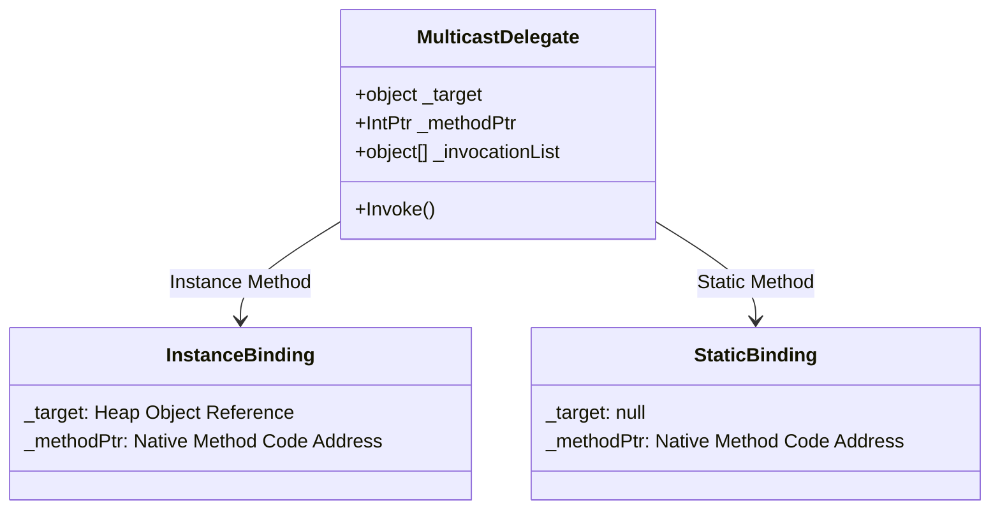
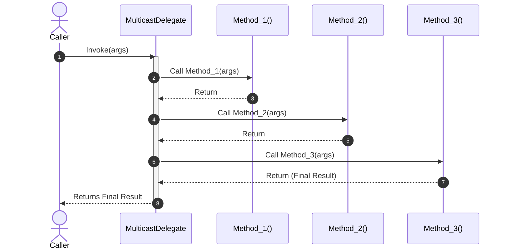
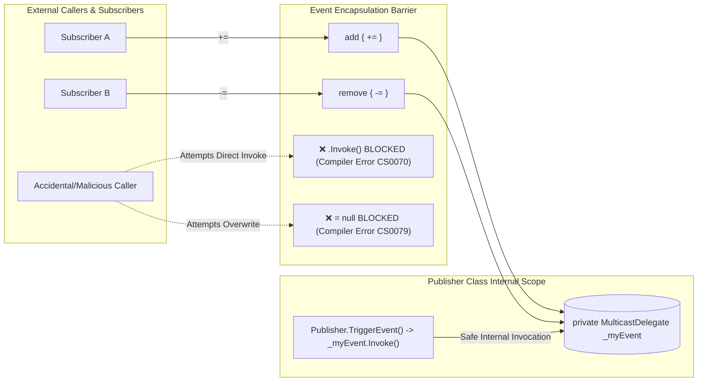

# Deep-Dive Guide: Delegates in C# & .NET (Fully Paired Bilingual Guide)

---

## 1. Explain in English
A **Delegate** in C# is a type-safe object that represents a reference to a method. It holds a reference to a method (either static or instance) with a specific parameter list and return type. Delegates enable methods to be passed as arguments, stored in data structures, assigned to variables, and executed dynamically at runtime. 

In modern .NET, delegates form the foundation of **Events**, **LINQ queries**, **Lambda expressions**, and **Asynchronous Callbacks**.

---

## 2. Explain in Bangla (বাংলায় সহজ ব্যাখ্যা)
সহজ কথায়, C# এ **Delegate** হলো একটি **"Method এর Type-Safe Pointer বা Reference"**। 

স্বাভাবিক ভ্যারিয়েবলে যেমন আমরা ডেটা (যেমন: `int x = 10;`, `string name = "Antigravity";`) স্টোর করি, তেমনি একটি Delegate ভ্যারিয়েবলে আমরা সরাসরি কোনো **Method বা Function** কে অ্যাসাইন করে রাখতে পারি। পরে সেই ভ্যারিয়েবলটি কল করলেই রেফারেন্স করা মেথডটি এক্সিকিউট হয়।

C++ এর function pointer এর মতো হলেও, C# এর Delegate সম্পূর্ণ **Type-Safe** এবং **Secure**—অর্থাৎ মেথডের প্যারামিটার টাইপ বা রিটার্ন টাইপ না মিললে কম্পাইলার সাথে সাথে কম্পাইল-টাইম এরর (Compile-time Error) দিয়ে আটকে দেবে।

---

## 3. Why It Exists (কেন তৈরি করা হয়েছে?)

### English:
Before delegates, passing behavior dynamically required complex class hierarchies, interface implementations, or unsafe memory pointers (like C/C++ function pointers). Delegates were introduced in .NET to provide:
1. **First-Class Functions**: The ability to treat methods as first-class citizens (pass methods into other methods).
2. **Decoupling (Loose Coupling)**: The caller does not need to know the concrete class or implementation of the method it executes; it only depends on the method's signature.
3. **Pluggable Event Systems**: Enabling a Publisher to notify multiple Subscribers without knowing who or what those subscribers are.
4. **Higher-Order Programming & LINQ**: Allowing expressive, functional-style querying where filtering, projection, and aggregation logic can be passed inline (e.g., `list.Where(x => x > 10)`).

### বাংলায় কারণ:
ডেলিগেট আসার পূর্বে কোনো মেথডকে ডায়নামিকালি অন্য কোথাও পাস করার জন্য জটিল ইন্টারফেস তৈরি করতে হতো অথবা C/C++ এর মতো আনসেফ মেমোরি পয়েন্টার ব্যবহার করতে হতো। .NET এ ডেলিগেট যুক্ত করার মূল কারণগুলো হলো:
1. **ফার্স্ট-ক্লাস মেথড সাপোর্ট**: মেথডকে সাধারণ ভ্যারিয়েবলের মতো অন্য মেথডে প্যারামিটার হিসেবে পাঠানো বা ভ্যারিয়েবলে সংরক্ষণ করা।
2. **লুজ কাপলিং (Decoupling)**: যে মেথডটি কল করছে (Caller) তার জানার দরকার নেই মেথডটি কোন ক্লাসের বা কীভাবে ইমপ্লিমেন্ট করা হয়েছে; কেবল মেথডের সিগনেচার (প্যারামিটার ও রিটার্ন টাইপ) মিললেই চলে।
3. **পাবলিশ-সাবস্ক্রাইব ইভেন্ট সিস্টেম**: কোনো একটি ইভেন্ট ঘটলে একাধিক সাবস্ক্রাইবার মেথডকে একসাথে নোটিফাই করা।
4. **ফাংশনাল প্রোগ্রামিং ও LINQ**: ডাটা ফিল্টারিং বা ট্রান্সফরমেশন লজিককে ইনলাইন ল্যাম্বডার মাধ্যমে পাস করার সুবিধা।

---

## 4. How It Works Under The Hood (অভ্যন্তরীণ মেকানিজম / Internals)

### English:
When you declare a delegate in C#:
```csharp
public delegate int MathOperation(int a, int b);
```
The C# compiler automatically generates a `sealed class` behind the scenes that inherits from `System.MulticastDelegate` (which in turn inherits from `System.Delegate` and `System.Object`).

```csharp
// Compiler-generated class representation:
public sealed class MathOperation : System.MulticastDelegate
{
    public MathOperation(object target, IntPtr methodPtr);
    public virtual int Invoke(int a, int b);
    public virtual IAsyncResult BeginInvoke(int a, int b, AsyncCallback callback, object @object);
    public virtual int EndInvoke(IAsyncResult result);
}
```

The runtime representation relies on three critical internal fields inside `System.MulticastDelegate`:
1. **`_target` (`object`)**: If the referenced method is an **instance method**, this field holds the reference to the object instance living on the Managed Heap. If the method is **static**, `_target` is `null`.
2. **`_methodPtr` (`IntPtr`)**: Holds the memory address of the JIT-compiled native code for the method (the actual function pointer).
3. **`_invocationList` (`object[]`)**: In a **Multicast Delegate** (when chaining methods with `+=`), this array holds the chained delegate instances, which are invoked sequentially when `.Invoke()` is called.

### বাংলায় অভ্যন্তরীণ মেকানিজম:
যখন আপনি C# এ কোনো `delegate` ডিক্লেয়ার করেন, কম্পাইলার ব্যাকগ্রাউন্ডে একটি `sealed class` তৈরি করে যা সরাসরি `System.MulticastDelegate` থেকে ইনহেরিট করে।

CLR এর মেমোরিতে এই ডেলিগেট ক্লাসের ভেতরে মূলত ৩টি ক্রিটিক্যাল ফিল্ড থাকে:
1. **`_target` (`object`)**: মেথডটি যদি কোনো ক্লাসের **Instance Method** হয়, তবে Managed Heap এ থাকা সেই অবজেক্ট ইনস্ট্যান্সের রেফারেন্স এখানে জমা থাকে। মেথডটি যদি **Static** হয়, তবে `_target` এর মান হয় `null`।
2. **`_methodPtr` (`IntPtr`)**: মেথডটির JIT-কম্পাইলড নেটিভ কোডের আসল মেমোরি এড্রেস (Function Pointer)।
3. **`_invocationList` (`object[]`)**: যখন `+=` দিয়ে একাধিক মেথড চেইন করা হয় (**Multicast Delegate**), তখন সবগুলো ডেলিগেট অবজেক্টের রেফারেন্স এই ইন্টারনাল অ্যারেতে থাকে। `.Invoke()` কল করলে এই লিস্ট ধরে একের পর এক মেথড এক্সিকিউট হয়।

---

## 5. Built-in Types & Simple Example (বিল্ট-ইন টাইপ ও সহজ উদাহরণ)

### The Built-in Delegate Types in .NET

Modern .NET provides standard generic delegates so you rarely need to declare custom delegate types with the `delegate` keyword:

| Built-in Type | Signature | Return Type | Typical Use Case |
| :--- | :--- | :--- | :--- |
| **`Action<T...>`** | `Action<T1, T2, ...>` (0 to 16 parameters) | `void` | Logging, side-effects, printing, event callbacks. |
| **`Func<T..., TResult>`** | `Func<T1, T2, ..., TResult>` (0 to 16 params + return) | `TResult` | Calculations, data transformations, LINQ `.Select()`. |
| **`Predicate<T>`** | `Predicate<T>` (Accepts exactly 1 parameter) | `bool` | Conditions, filtering, searching (e.g., `List.FindAll`). |
| **`EventHandler<TEventArgs>`**| `(object? sender, TEventArgs e)` | `void` | Standard .NET event model for UI and domain events. |
| **`Comparison<T>`** | `(T x, T y)` | `int` | Sorting logic (returns `< 0`, `0`, or `> 0`). |

#### বাংলায় বিল্ট-ইন ডেলিগেট টাইপসমূহ:
1. **`Action<T>`**: যেসব মেথড কোনো ভ্যালু রিটার্ন করে না (`void`), সেগুলোর জন্য `Action` ব্যবহার করা হয়। এটি ০ থেকে ১৬টি প্যারামিটার নিতে পারে।
2. **`Func<T, TResult>`**: যেসব মেথড থেকে কোনো রেজাল্ট বা ভ্যালু ফেরত পেতে হয়, সেগুলোর জন্য `Func` ব্যবহার করা হয়। এর সর্বশেষ জেনেরিক প্যারামিটারটি হলো মেথডের Return Type।
3. **`Predicate<T>`**: এটি ১টি প্যারামিটার গ্রহণ করে এবং সবসময় `bool` (`true`/`false`) রিটার্ন করে। এটি মূলত `Func<T, bool>` এর একটি স্পেশাল রূপ।
4. **`EventHandler<TEventArgs>`**: .NET এর অফিশিয়াল ইভেন্ট আর্কিটেকচারের জন্য স্ট্যান্ডার্ড ডেলিগেট।
5. **`Comparison<T>`**: কালেকশন সর্ট করার কাস্টম তুলনামূলক লজিক সংজ্ঞায়িত করতে ব্যবহৃত হয়।

### Code Example: Custom & Built-in Delegates

```csharp
using System;
using System.Collections.Generic;

namespace DelegateDemo
{
    // 1. Custom Delegate Declaration (Traditional)
    public delegate void CustomLogger(string message);

    public class Program
    {
        public static void Main()
        {
            // --- Custom Delegate & Multicast ---
            CustomLogger logger = LogToConsole;
            logger += LogToFile; // Multicast chaining
            logger("Application started."); // Invokes both methods

            // --- Built-in Delegate: Action<T> (Returns void) ---
            Action<string> printNotification = msg => 
                Console.WriteLine($"[Action Notification]: {msg}");
            printNotification("Order #1001 created.");

            // --- Built-in Delegate: Func<T1, T2, TResult> (Returns value) ---
            Func<int, int, int> calculateSum = (a, b) => a + b;
            int sum = calculateSum(15, 25);
            Console.WriteLine($"[Func Sum Result]: {sum}");

            // --- Built-in Delegate: Predicate<T> (Returns bool) ---
            Predicate<int> isEven = number => number % 2 == 0;
            Console.WriteLine($"[Predicate IsEven 10]: {isEven(10)}");

            // --- Built-in Delegate: Comparison<T> (Sorting) ---
            List<string> names = new() { "Charlie", "Alice", "Bob" };
            Comparison<string> lengthComparer = (a, b) => a.Length.CompareTo(b.Length);
            names.Sort(lengthComparer);
            Console.WriteLine($"Sorted by length: {string.Join(", ", names)}");
        }

        public static void LogToConsole(string msg) => Console.WriteLine($"Console: {msg}");
        public static void LogToFile(string msg) => Console.WriteLine($"File Log: {msg}");
    }
}
```

---

## 6. Events in C#: Why Do We Need Them? (Delegates vs. Events)

### The Core Problem with Raw Delegates (কেন কেবল ডেলিগেট যথেষ্ট নয়?)

#### English:
If a class exposes a raw public delegate field:
```csharp
public class StockTicker
{
    public Action<decimal>? PriceChanged; // Raw Public Delegate
}
```
External consumers can abuse this in two disastrous ways:
1. **Accidental Overwriting (Wiping All Subscribers)**:
   A subscriber can write `ticker.PriceChanged = MyHandler;` instead of `+=`. This silently deletes all previous subscribers attached by other classes. Worse, any external code can write `ticker.PriceChanged = null;`, wiping out the entire subscriber list.
2. **Unauthorized Invocation**:
   Any external caller can execute `ticker.PriceChanged(999m);` directly, arbitrarily firing an internal event that only the `StockTicker` should have the authority to raise!

#### বাংলায় সমস্যা:
যদি কোনো ক্লাসে একটি সাধারণ `public` ডেলিগেট ফিল্ড রাখা হয়, বাইরের যেকোনো কোড মারাত্মক দুটি সমস্যা তৈরি করতে পারে:
1. **সবাইকে মুছে ফেলার ঝুঁকি (Accidental Overwrite)**:
   সাবস্ক্রাইব করার সময় কোনো ডেভেলপার যদি ভুলবশত `+=` না দিয়ে `=` ব্যবহার করে (`ticker.PriceChanged = MyMethod;`), তবে আগের সব সাবস্ক্রাইবারের রেফারেন্স সাথে সাথে মুছে যাবে। এমনকি যে কেউ `ticker.PriceChanged = null;` লিখে পুরো লিস্ট ফাঁকা করে দিতে পারে।
2. **অননুমোদিত এক্সিকিউশন (Unauthorized Invocation)**:
   বাইরের যেকোনো কোড সরাসরি `ticker.PriceChanged(999m);` কল করে ইভেন্ট ট্রিগার করে দিতে পারে, যা ক্লাসের ইন্টারনাল সিকিউরিটি ও এনক্যাপসুলেশন পুরোপুরি ভেঙে দেয়।

---

### What the `event` Keyword Actually Does Under the Hood

#### English:
The `event` keyword is a **compiler-enforced encapsulation wrapper** over a private multicast delegate. 

When you write:
```csharp
public class StockTicker
{
    public event Action<decimal>? PriceChanged; // Encapsulated Event
}
```

The C# compiler automatically transforms it into:
```csharp
public class StockTicker
{
    // 1. Private backing delegate field (Hidden from outside world)
    private Action<decimal>? _priceChanged;

    // 2. Public Event Accessors (Restricted interface)
    public event Action<decimal>? PriceChanged
    {
        add
        {
            // Thread-safe delegate combination (Delegate.Combine)
            _priceChanged = (Action<decimal>)Delegate.Combine(_priceChanged, value);
        }
        remove
        {
            // Thread-safe delegate removal (Delegate.Remove)
            _priceChanged = (Action<decimal>)Delegate.Remove(_priceChanged, value);
        }
    }

    protected virtual void OnPriceChanged(decimal newPrice)
    {
        _priceChanged?.Invoke(newPrice); // Only THIS class can raise the event!
    }
}
```

#### The Mental Model (Field vs Property == Delegate vs Event):
> **In C#, an `event` is to a `delegate` what a `property` is to a `field`!**
> - A **Field** is raw storage; a **Property** wraps it with `get` and `set`.
> - A **Delegate** is raw storage; an **Event** wraps it with `add` and `remove`.

#### বাংলায় ব্যাখ্যা:
`event` হলো ডেলিগেটের ওপর কম্পাইলারের তৈরি একটি **প্রটেকশন শিল্ড বা এনক্যাপসুলেশন র‍্যাপার**। 
- কম্পাইলার ব্যাকগ্রাউন্ডে আসল ডেলিগেটটিকে `private` ফিল্ড বানিয়ে ফেলে।
- বাইরের জন্য কেবল দুটি মেথড উন্মুক্ত করে: `add` (যা `+=` হ্যান্ডেল করে) এবং `remove` (যা `-=` হ্যান্ডেল করে)।
- এর ফলে বাইরের কেউ কখনোই `=` দিয়ে অন্য কাউকে মুছতে পারে না, কিংবা ক্লাসের বাইরে থেকে ইভেন্ট কল করতে পারে না। শুধুমাত্র ইভেন্টের মালিক ক্লাসই ইভেন্টটি ট্রিগার (`.Invoke()`) করতে পারে।

---

### Comparison: Delegate vs. Event

| Feature | Raw Delegate (`Action` / `Func`) | Event (`event Action` / `event EventHandler`) |
| :--- | :--- | :--- |
| **External `+=` / `-=`** | Allowed | Allowed |
| **External `=` Assignment** | **Allowed** (DANGEROUS: wipes other listeners) | **Forbidden** (Compiler error `CS0079`) |
| **External Direct Invocation** | **Allowed** (`obj.MyDel()`) | **Forbidden** (Compiler error `CS0070`) |
| **Can be an Interface Member**| No | **Yes** (`event EventHandler OnChanged;`) |
| **Underlying IL Structure** | Raw Type Reference or Field | Private Field + `add_` & `remove_` IL methods |
| **Primary Intent** | Passing callbacks & strategies dynamically | Implementing Publisher-Subscriber pattern |

---

## 7. Real-World Production Example (বাস্তব প্রোডাকশন উদাহরণ)

### English:
In enterprise systems, we combine both:
- **Delegates** for the **Strategy Pattern** (e.g., passing custom discount calculations into an engine).
- **Events** for the **Observer / Pub-Sub Pattern** (e.g., safely notifying audit loggers and notification services when an order completes).

### বাংলায় প্রেক্ষাপট:
প্রোডাকশন সিস্টেমে দুটিই একসাথে ব্যবহৃত হয়:
- কোনো ক্যালকুলেশন বা পলিসি পাস করতে ব্যবহৃত হয় **Delegate** (Strategy Pattern)।
- কাজ শেষ হওয়ার পর অন্যদের নিরাপদভাবে নোটিফাই করতে ব্যবহৃত হয় **Event** (Observer Pattern)।

```csharp
using System;

public record Order(int Id, decimal Amount, string CustomerTier);

// Event Arguments holding contextual event payload
public class OrderCompletedEventArgs : EventArgs
{
    public Order Order { get; }
    public decimal FinalAmount { get; }

    public OrderCompletedEventArgs(Order order, decimal finalAmount)
    {
        Order = order;
        FinalAmount = finalAmount;
    }
}

public class OrderProcessor
{
    // 1. Strategy DELEGATE: Injected policy for computing discounts
    public Func<Order, decimal> DiscountCalculator { get; set; }

    // 2. Encapsulated EVENT: Only OrderProcessor can trigger this!
    public event EventHandler<OrderCompletedEventArgs>? OrderCompleted;

    public OrderProcessor(Func<Order, decimal>? discountCalculator = null)
    {
        DiscountCalculator = discountCalculator ?? (_ => 0m);
    }

    public decimal Process(Order order)
    {
        decimal discount = DiscountCalculator(order);
        decimal finalAmount = Math.Max(0, order.Amount - discount);

        // Safe raising pattern (Thread-safe null-conditional invoke)
        OnOrderCompleted(new OrderCompletedEventArgs(order, finalAmount));

        return finalAmount;
    }

    // Standard protected virtual event dispatcher pattern
    protected virtual void OnOrderCompleted(OrderCompletedEventArgs e)
    {
        OrderCompleted?.Invoke(this, e);
    }
}

public class Program
{
    public static void Main()
    {
        // VIP policy: 20% discount
        var processor = new OrderProcessor(order => order.CustomerTier == "VIP" ? order.Amount * 0.20m : 0m);

        // Subscriber 1: Audit Logger
        processor.OrderCompleted += (sender, e) =>
            Console.WriteLine($"[AUDIT] Order #{e.Order.Id} completed for ${e.FinalAmount:F2}");

        // Subscriber 2: Notification Service
        processor.OrderCompleted += (sender, e) =>
            Console.WriteLine($"[EMAIL] Receipt dispatched to customer for Order #{e.Order.Id}");

        // The following line would CAUSE A COMPILER ERROR because OrderCompleted is an EVENT:
        // processor.OrderCompleted = null;             // ERROR CS0079: The event can only appear on the left hand side of += or -=
        // processor.OrderCompleted.Invoke(this, e);    // ERROR CS0070: The event can only be raised from within the class

        var order = new Order(501, 1000m, "VIP");
        processor.Process(order);
    }
}
```

---

## 7. Visual Diagram (ডায়াগ্রাম)

### Memory Model of Singlecast vs Multicast Delegates



### Execution Flow of Multicast Delegate Invocation



### Event Encapsulation & Protection Barrier



---

## 8. Common Mistakes & Gotchas (সাধারণ ভুল ও ফাঁদ)

### ⚠️ Pitfall 1: Multicast Return Value Loss
- **English**: If a multicast delegate has a non-void return type (e.g., `Func<int>`), all chained methods execute, but **only the return value of the very last method** is returned to the caller. The return values of earlier methods are discarded.
- **বাংলায় ফাঁদ**: Multicast Delegate এ যদি কোনো রিটার্ন টাইপ থাকে (যেমন `Func<int>`), তবে চেইনের সব মেথড এক্সিকিউট হলেও **শুধুমাত্র সর্বশেষ মেথডের রিটার্ন ভ্যালু** কলারের কাছে ফেরত আসবে। আগের মেথডগুলোর রিটার্ন ভ্যালু হারিয়ে যায়।

### ⚠️ Pitfall 2: The Broken Invocation Chain (Exceptions)
- **English**: If any method in a multicast chain throws an unhandled exception, execution stops immediately. None of the subsequent methods in the chain will execute.
- **বাংলায় ফাঁদ**: Multicast চেইনের মাঝে কোনো একটি মেথডে এক্সেপশন থ্রো হলে পুরো এক্সিকিউশন বন্ধ হয়ে যায় এবং **পরবর্তী মেথডগুলো আর কল হয় না**।
- **Senior Solution (সিনিয়র সমাধান)**: Use `GetInvocationList()` and iterate through delegates with explicit `try-catch` blocks:
  ```csharp
  foreach (Delegate handler in myMulticastDelegate.GetInvocationList())
  {
      try { handler.DynamicInvoke(args); }
      catch (Exception ex) { /* Log and continue to next handler */ }
  }
  ```

### ⚠️ Pitfall 3: Memory Leaks via Uncollected Target References
- **English**: A delegate holds a strong reference to its target object in `_target`. If a short-lived object subscribes to an event/delegate on a long-lived object (like a Singleton service) and fails to unsubscribe (`-=`), the Garbage Collector **cannot collect** the short-lived object, leading to a silent memory leak.
- **বাংলায় ফাঁদ**: ডেলিগেটের `_target` ফিল্ড মেথডের অবজেক্ট ইনস্ট্যান্সকে স্ট্রং রেফারেন্স হিসেবে ধরে রাখে। কোনো লং-লিভড অবজেক্টের (যেমন Singleton Service) ডেলিগেটে কোনো শর্ট-লিভড অবজেক্ট সাবস্ক্রাইব করে আনসাবস্ক্রাইব (`-=`) না করলে, শর্ট-লিভড অবজেক্টকে **Garbage Collector মেমোরি থেকে মুক্ত করতে পারে না**।

---

## 9. Interview Perspective (ইন্টারভিউ প্রস্তুতি)

### Q1: What is the fundamental difference between a `Delegate` and an `Event`?
- **English Pitch**: A delegate is a standalone type and callable variable that anyone can invoke (`d()`) or overwrite (`d = null;`) directly from outside. An `event` is a compiler-enforced encapsulation wrapper over a multicast delegate that only exposes `+=` (subscribe) and `-=` (unsubscribe) to external consumers, preventing external callers from invoking or clearing the listener list.
- **বাংলায় ব্যাখ্যা**: ডেলিগেট হলো একটি মুক্ত ভ্যারিয়েবল যা ক্লাসের বাইরে থেকে যে কেউ সরাসরি কল (`d()`) করতে পারে বা নাল (`d = null;`) করে দিয়ে অন্যদের মুছে দিতে পারে। পক্ষান্তরে, **`Event` হলো ডেলিগেটের ওপর একটি প্রটেকশন বা এনক্যাপসুলেশন র‍্যাপার**। এটি বাইরের কাউকে কেবল সাবস্ক্রাইব (`+=`) বা আনসাবস্ক্রাইব (`-=`) করার অনুমতি দেয়; ক্লাসের বাইরে থেকে ইভেন্ট ট্রিগার বা মুছে ফেলা সম্পূর্ণ নিষিদ্ধ।

### Q2: What are the differences between `Action<T>`, `Func<T>`, and `Predicate<T>`?
- **English Pitch**: `Action<T>` takes 0 to 16 arguments and returns `void`. `Func<T, TResult>` takes 0 to 16 arguments and always returns a value of type `TResult`. `Predicate<T>` takes exactly 1 parameter and always returns a `bool` (conceptually equivalent to `Func<T, bool>`).
- **বাংলায় ব্যাখ্যা**: `Action` কোনো ভ্যালু রিটার্ন করে না (`void`), `Func` সবসময় একটি ভ্যালু রিটার্ন করে (শেষের টাইপটি রিটার্ন টাইপ), এবং `Predicate` সবসময় ১টি প্যারামিটার নিয়ে একটি `bool` রিটার্ন করে (মূলত ফিল্টারিং বা কন্ডিশন চেকের জন্য)।

### Q3: Does using delegates/lambdas cause GC allocation overhead?
- **English Pitch**: Static method delegates and cached instance delegates have minimal overhead. However, when a lambda expression captures an outer local variable (a **Closure**), the C# compiler allocates a hidden display class instance on the Managed Heap to preserve the variable's state, resulting in GC allocation pressure on high-frequency execution paths.
- **বাংলায় ব্যাখ্যা**: সাধারণ মেথড রেফারেন্সে ওভারহেড কম হলেও, যখন কোনো ল্যাম্বডার ভেতর বাইরের কোনো লোকাল ভ্যারিয়েবল ব্যবহার করা হয় (যাকে **Closure** বলা হয়), কম্পাইলার ব্যাকগ্রাউন্ডে একটি হিডেন ক্লাস তৈরি করে হিপ মেমোরিতে (Heap) অবজেক্ট অ্যালোকেট করে। হাই-পারফরম্যান্স লুপে এটি প্রচুর GC Allocation তৈরি করে।

---

## 📂 Workspace Code References
- Singlecast & Static Delegates: [`Delegate/01-DelegetDemo1/Program.cs`](file:///d:/Interview/c-sharp-prep/Delegate/01-DelegetDemo1/Program.cs)
- Multicast Delegates: [`Delegate/03-MulticastDelegetDemo3/Program.cs`](file:///d:/Interview/c-sharp-prep/Delegate/03-MulticastDelegetDemo3/Program.cs)
- Generic Delegates (`Func`/`Action`): [`Delegate/GenericDelegetDemo5/Program.cs`](file:///d:/Interview/c-sharp-prep/Delegate/GenericDelegetDemo5/Program.cs)
