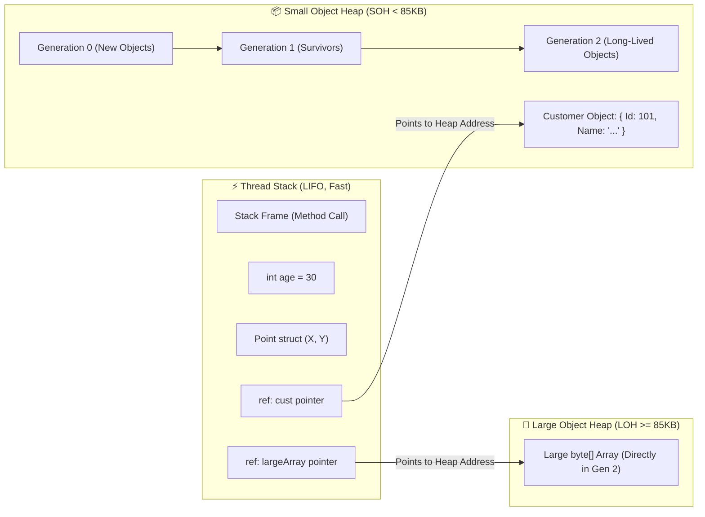
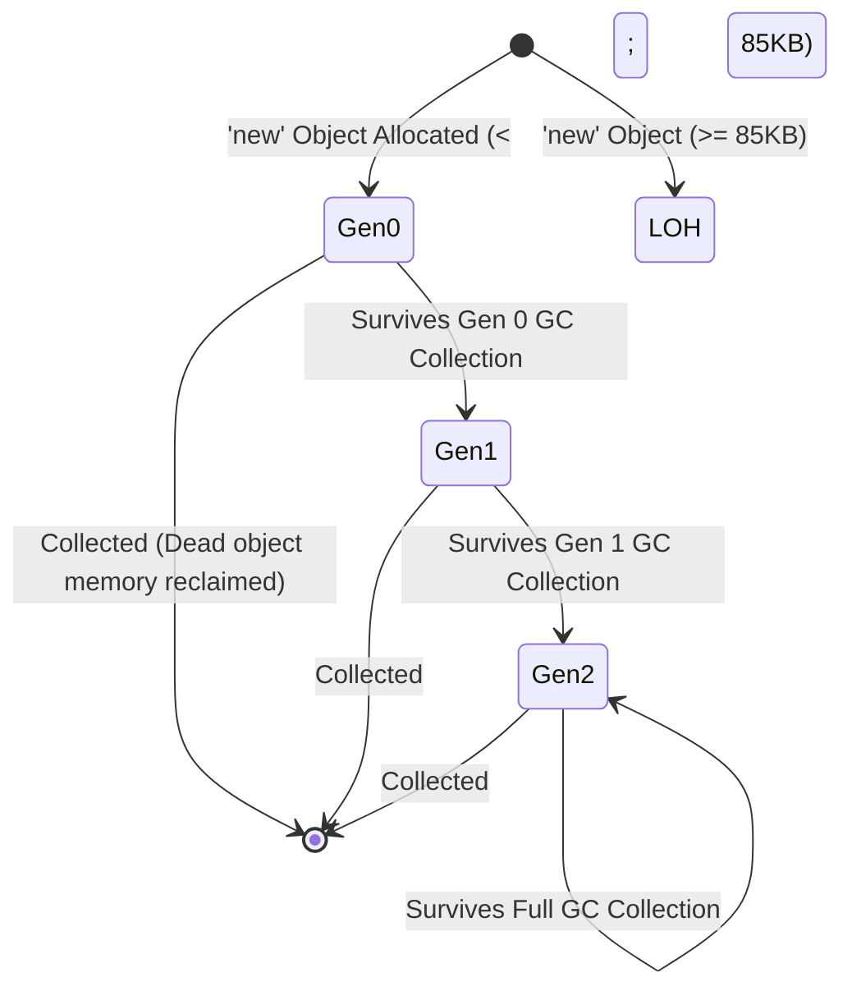

# Deep-Dive Guide: Stack, Heap, Garbage Collection (GC) & CLR Internals (Fully Paired Bilingual Guide)

---

## 1. Concept in English
The **Common Language Runtime (CLR)** is the virtual execution engine of .NET that manages the complete lifecycle of C# applications. Its core responsibilities include Just-In-Time (JIT) compilation, thread execution, exception management, type safety, and **automatic memory management**. 

In .NET, memory is categorized into two fundamental regions:
- **The Stack**: High-speed, thread-local memory where method call frames, primitive value types, and object reference pointers are allocated. It follows a strict LIFO (Last-In, First-Out) model and requires zero Garbage Collector overhead because memory is cleaned automatically when the method scope returns.
- **The Managed Heap**: A contiguous block of virtual memory managed by the **Garbage Collector (GC)**. All reference type instances (objects, arrays, strings) reside here. The GC periodically scans this memory to reclaim unreferenced (dead) objects and compacts remaining survivors to eliminate fragmentation.

---

## 2. Concept in Bangla (বাংলায় সহজ ব্যাখ্যা)
**Common Language Runtime (CLR)** হলো .NET এর ভার্চুয়াল এক্সিকিউশন ইঞ্জিন—যা .NET অ্যাপ্লিকেশনের "হৃদপিণ্ড" বা অপারেটিং সিস্টেমের মতো কাজ করে। এটি আপনার C# কোডকে রানটাইমে এক্সিকিউট করা, JIT (Just-In-Time) কম্পাইলেশন, থ্রেড ম্যানেজমেন্ট, এক্সেপশন হ্যান্ডলিং এবং স্বয়ংক্রিয় মেমোরি ম্যানেজমেন্টের দায়িত্ব পালন করে।

.NET এ মেমোরি মূলত দুটি প্রধান ভাগে বিভক্ত:
- **Stack (স্ট্যাক মেমোরি)**: এটি প্রতিটি থ্রেডের নিজস্ব অতি দ্রুতগতির মেমোরি। যখন কোনো মেথড কল হয়, তখন তার জন্য একটি "Stack Frame" তৈরি হয় এবং মেথডের লোকাল ভ্যারিয়েবল, ভ্যালু টাইপ (`int`, `bool`, `struct`) এবং অবজেক্টের রেফারেন্স অ্যাড্রেস এখানে জমা থাকে। মেথডের কাজ শেষ হওয়ার সাথে সাথে স্ট্যাক থেকে স্বয়ংক্রিয়ভাবে মেমোরি খালি হয়ে যায় (LIFO - Last-In, First-Out নিয়মে)। এখানে কোনো Garbage Collector লাগে না।
- **Managed Heap (হিপ মেমোরি)**: এটি একটি বিশাল ভার্চুয়াল মেমোরি পুল যেখানে সমস্ত রেফারেন্স টাইপ অবজেক্ট (`class`, `string`, `array`) তৈরি হয়। এখানে অবজেক্টের লাইফটাইম কোনো নির্দিষ্ট মেথড বা ব্লকের ওপর নির্ভর করে না। এই হিপ মেমোরি পরিষ্কার এবং পরিচালনা করার সম্পূর্ণ দায়িত্ব হলো **Garbage Collector (GC)** এর।

---

## 3. Why It Exists (কেন তৈরি করা হয়েছে?)

### English:
In unmanaged languages like C and C++, developers must explicitly allocate (`malloc`/`new`) and deallocate (`free`/`delete`) memory. This manual process causes severe production failures:
1. **Dangling Pointers**: Accessing memory after it has already been freed, causing arbitrary crashes or security exploits.
2. **Double Free Errors**: Freeing the same memory block twice, leading to heap corruption.
3. **Memory Leaks**: Forgetting to free memory, causing the application to consume endless RAM until the server crashes.

The .NET CLR and Garbage Collector were designed to provide **Memory Safety**: developers focus purely on business logic while the runtime safely allocates, tracks object lifetimes, and automatically reclaims memory without memory corruption.

### বাংলায় কারণ:
C বা C++ এর মতো আনম্যানেজড প্রোগ্রামিং ভাষায় ডেভেলপারকে নিজে কোড লিখে মেমোরি নিতে (`malloc`/`new`) হতো এবং কাজ শেষে মেমোরি খালি (`free`/`delete`) করতে হতো। এর ফলে বাস্তব জীবনে মারাত্মক সমস্যা তৈরি হতো:
1. **মেমোরি লিক (Memory Leaks)**: কোডার মেমোরি ফ্রি করতে ভুলে গেলে র‍্যাম (RAM) ক্রমাগত ফুল হতে হতে পুরো সার্ভার ক্র্যাশ করত।
2. **ড্যাংলিং পয়েন্টার (Dangling Pointers)**: যে মেমোরি ডিলিট করে দেওয়া হয়েছে, কোড এখনো সেই পয়েন্টারে ডাটা অ্যাক্সেস করতে গিয়ে ক্র্যাশ করত।
3. **ডাবল ফ্রি (Double Free)**: একই মেমোরি দুইবার ডিলিট করতে গিয়ে হিপ মেমোরি করাপ্ট হয়ে যেত।

এই সমস্যাগুলো চিরতরে দূর করতে Microsoft .NET এর সাথে **CLR এবং স্বয়ংক্রিয় Garbage Collector (GC)** নিয়ে আসে, যাতে ডেভেলপারকে মেমোরি ডিলিট করার চিন্তা করতে না হয়—রানটাইম নিজে মেমোরি সেফটি নিশ্চিত করে।

---

## 4. How It Works Under The Hood (অভ্যন্তরীণ মেকানিজম / CLR Internals)

### English:
The .NET Managed Heap is divided into distinct sections based on size and pinning:
1. **Small Object Heap (SOH)**: Stores objects smaller than 85,000 bytes. It is subdivided into three generations:
   - **Generation 0 (Gen 0)**: The ephemeral generation where newly allocated objects live. Collections are ultra-fast (sub-millisecond).
   - **Generation 1 (Gen 1)**: Serves as a buffer between short-lived and long-lived objects.
   - **Generation 2 (Gen 2)**: Long-lived objects (static data, singletons, objects surviving multiple GC runs). A collection here is known as a **Full GC**.
2. **Large Object Heap (LOH)**: Stores objects **>= 85,000 bytes** (primarily large arrays and strings). LOH is treated as Gen 2. Because moving large memory blocks is costly, LOH was traditionally not compacted, leading to **heap fragmentation**.
3. **Pinned Object Heap (POH)** (Introduced in .NET 5): Specifically isolates pinned objects (buffers passed to unmanaged APIs) so they do not fragment Gen 0/1/2.

#### The 3 Phases of Garbage Collection:
1. **Mark Phase**: The GC builds a graph of "Roots" (CPU registers, stack variables, static fields). It traverses all reachable objects and marks them as "Alive". Any object not reachable from a root is marked as "Dead/Garbage".
2. **Sweep Phase**: The GC identifies the memory blocks occupied by dead objects.
3. **Compact Phase**: The GC shifts living objects together toward the beginning of the heap to create contiguous free space, and updates all pointers on the stack to point to the new addresses.

### বাংলায় অভ্যন্তরীণ মেকানিজম:
.NET এ Managed Heap মেমোরি অবজেক্টের সাইজের ওপর ভিত্তি করে কয়েকটি ভাগে বিভক্ত থাকে:
1. **Small Object Heap (SOH)**: যেসব অবজেক্টের সাইজ **৮৫,০০০ বাইটস (85 KB)** এর কম, সেগুলো এখানে জমা হয়। SOH ৩টি জেনারেশনে বিভক্ত:
   - **Gen 0**: নতুন তৈরি হওয়া অবজেক্ট প্রথমে Gen 0 তে আসে। এটি অত্যন্ত দ্রুত ক্লিন হয় (১ মিলিসেকেন্ডেরও কম সময়ে)।
   - **Gen 1**: এটি শর্ট-লিভড এবং লং-লিভড অবজেক্টের মধ্যে বাফার হিসেবে কাজ করে। Gen 0 এর ক্লিনিংয়ে যারা বেঁচে যায়, তারা Gen 1 এ প্রমোশন পায়।
   - **Gen 2**: যেসব অবজেক্ট দীর্ঘদিন বাঁচে (যেমন Singleton Service, Static Data, Cache) তারা Gen 2 তে আসে। Gen 2 পরিষ্কার করাকে **Full GC** বলা হয় এবং এটি সবচেয়ে ব্যয়বহুল (CPU Intensive)।
2. **Large Object Heap (LOH)**: যেসব অবজেক্টের সাইজ **৮৫,০০০ বাইটস বা তার বেশি** (যেমন বড় সাইজের অ্যারে বা ইমেজ বাইটস), সেগুলো সরাসরি LOH এ যায়। বড় অবজেক্ট মেমোরিতে নাড়াচাড়া করা অত্যন্ত ব্যয়বহুল, তাই ডিফল্টভাবে LOH কম্প্যাক্ট করা হয় না, যার ফলে মেমোরি ফ্র্যাগমেন্টেশন (Fragmentation) ঘটে।
3. **Pinned Object Heap (POH)** (.NET 5+ এ যুক্ত): যে অবজেক্টগুলোকে আনম্যানেজড কোডের জন্য মেমোরিতে ফিক্সড বা পিন করে রাখা হয়, যাতে সাধারণ হিপ ফ্র্যাগমেন্ট না হয়।

#### গারবেজ কালেকশনের ৩টি ধাপ:
1. **Mark Phase (মার্ক পর্যায়)**: GC সমস্ত "GC Roots" (স্ট্যাকের ভ্যারিয়েবল, CPU রেজিস্টার, স্ট্যাটিক রেফারেন্স) চেক করে একটি ট্রি তৈরি করে এবং যেসব অবজেক্টের সাথে কানেকশন পাওয়া যায় তাদের "Alive" হিসেবে মার্ক করে। বাকিগুলোকে "Dead" ধরে নেয়।
2. **Sweep Phase (সুইপ পর্যায়)**: যে অবজেক্টগুলো Dead, সেগুলোর মেমোরি ফ্রি স্পেস হিসেবে চিহ্নিত করে।
3. **Compact Phase (কম্প্যাক্ট পর্যায়)**: মেমোরির ফাঁকা জায়গা দূর করতে জীবিত অবজেক্টগুলোকে একপাশে চেপে নিয়ে এসে এক জায়গায় সাজায় এবং স্ট্যাকের পয়েন্টারগুলোকে নতুন মেমোরি অ্যাড্রেসে আপডেট করে।

---

## 5. Built-in Types & Simple Example (বিল্ট-ইন টাইপ ও সহজ উদাহরণ)

### Framework Built-in Memory Management Types:

| Built-in Type / API | Namespace | Purpose / Description |
| :--- | :--- | :--- |
| **`GC`** | `System` | Controls and inspects the garbage collector (`GC.Collect()`, `GC.GetGeneration()`, `GC.SuppressFinalize()`, `GC.GetTotalMemory()`). |
| **`IDisposable`** | `System` | Defines a deterministic cleanup mechanism (`Dispose()`) for unmanaged resources (file handles, database connections, sockets). |
| **`IAsyncDisposable`** | `System` | Asynchronous resource release mechanism (`DisposeAsync()`). |
| **`WeakReference<T>`** | `System` | References an object while still allowing it to be collected by the GC (great for non-critical caches). |
| **`Span<T>` / `ReadOnlySpan<T>`** | `System` | Stack-only `ref struct` enabling zero-allocation memory slicing without creating heap substrings. |
| **`ArrayPool<T>`** | `System.Buffers` | Rents and returns reusable arrays to prevent Large Object Heap (LOH) allocations and GC pressure. |

#### বাংলায় বিল্ট-ইন টাইপসমূহ:
1. **`GC` Class**: রানটাইমের গারবেজ কালেক্টরকে মনিটর ও নিয়ন্ত্রণ করার স্ট্যাটিক ক্লাস (যেমন: `GC.SuppressFinalize` যা ফাইনলাইজার বন্ধ করে পারফরম্যান্স বাড়ায়)।
2. **`IDisposable` ও `using`**: আনম্যানেজড রিসোর্স (যেমন ফাইল স্ট্রিম, ডাটাবেজ কানেকশন) কাজ শেষ হওয়ার সাথে সাথে তৎক্ষণাৎ বন্ধ করার স্ট্যান্ডার্ড ইন্টারফেস।
3. **`WeakReference<T>`**: অবজেক্টের এমন একটি রেফারেন্স ধরে রাখে যাতে মেমোরি ঘাটতি হলে GC তাকে অনায়াসে ডিলিট করতে পারে (ক্যাশিং এর জন্য আদর্শ)।
4. **`Span<T>`**: সম্পূর্ণ স্ট্যাক-বেসড মেমোরি স্লাইস যা কোনো হিপ অ্যালোকেশন ছাড়াই সাব-স্ট্রিং বা অ্যারে প্রসেস করতে পারে।
5. **`ArrayPool<T>`**: প্রতিবার নতুন অ্যারে তৈরি না করে মেমোরি পুল থেকে অ্যারে ভাড়া (Rent) নিয়ে কাজ শেষে আবার ফেরত (Return) দেওয়ার মেকানিজম, যা LOH ফ্র্যাগমেন্টেশন রোধ করে।

### Code Example: Stack vs Heap Allocation & GC APIs

```csharp
using System;

namespace MemoryManagementDemo
{
    // Reference Type -> Instances allocated on the Managed Heap
    public class Customer
    {
        public int Id { get; set; }        // 4 bytes inside the Heap object
        public string Name { get; set; }   // Reference pointer to string on Heap
    }

    // Value Type -> Stored inline wherever it is declared (Stack or inside container)
    public struct Point
    {
        public int X;
        public int Y;
    }

    public class Program
    {
        public static void Main()
        {
            // 1. Primitive Value Types -> Allocated directly on the Thread Stack
            int age = 30;
            Point p = new Point { X = 10, Y = 20 };

            // 2. Reference Type:
            // - 'cust' (reference variable / 8 bytes on 64-bit) lives on the Stack
            // - The actual 'Customer' object data lives on the Managed Heap
            Customer cust = new Customer { Id = 101, Name = "Antigravity" };

            // 3. Inspecting GC Generation
            Console.WriteLine($"Customer is currently in Generation: {GC.GetGeneration(cust)}");

            // 4. Checking Memory Consumption
            long memoryUsed = GC.GetTotalMemory(forceFullCollection: false);
            Console.WriteLine($"Total Managed Memory: {memoryUsed / 1024} KB");

            // 5. WeakReference Demonstration
            WeakReference<Customer> weakRef = new WeakReference<Customer>(cust);

            // Removing strong reference from stack
            cust = null!; 

            // Checking if object is still alive before GC
            if (weakRef.TryGetTarget(out Customer? target))
            {
                Console.WriteLine($"Customer #{target.Id} is still alive in memory.");
            }
        }
    }
}
```

---

## 6. Real-World Production Example (বাস্তব প্রোডাকশন উদাহরণ)

### Production Memory Optimization: `ArrayPool<T>` + `IDisposable` with `GC.SuppressFinalize`

#### English:
In high-throughput services (like processing 10,000 files/sec or large API payloads), allocating a `new byte[100000]` on every request immediately floods the Large Object Heap (LOH), triggering severe Gen 2 Full GC pauses. The enterprise solution combines the **Standard Dispose Pattern** with **ArrayPool<byte>** to achieve zero Gen 2 allocations.

#### বাংলায় প্রেক্ষাপট:
উচ্চ-গতির এন্টারপ্রাইজ সিস্টেমে (যেমন প্রতি সেকেন্ডে হাজার হাজার ফাইল রিড করা বা API পেলোড প্রসেস করা) যদি প্রতি রিকোয়েস্টে `new byte[100000]` তৈরি করা হয়, তবে তা সরাসরি Large Object Heap (LOH) এ যায়। এর ফলে বারবার Gen 2 Full GC ট্রিগার হয়ে পুরো সার্ভার সাময়িকভাবে ফ্রিজ (Stop-The-World) হয়ে যায়। প্রফেশনাল সিস্টেমে **ArrayPool** ব্যবহার করে অ্যারে রেন্ট করা হয় এবং **Standard Dispose Pattern** দিয়ে মেমোরি রিসাইকেল করা হয়।

```csharp
using System;
using System.Buffers;
using System.IO;

public class HighThroughputBufferProcessor : IDisposable
{
    private byte[]? _rentedBuffer;
    private bool _disposed = false;
    private const int BufferSize = 120_000; // > 85KB -> Would normally hit LOH!

    public HighThroughputBufferProcessor()
    {
        // Rent from shared pool instead of allocating 'new byte[BufferSize]' on LOH!
        _rentedBuffer = ArrayPool<byte>.Shared.Rent(BufferSize);
    }

    public void ProcessStream(Stream inputStream)
    {
        if (_disposed || _rentedBuffer == null) 
            throw new ObjectDisposedException(nameof(HighThroughputBufferProcessor));

        int bytesRead = inputStream.Read(_rentedBuffer, 0, BufferSize);
        Console.WriteLine($"[Zero-Allocation]: Processed {bytesRead} bytes safely using ArrayPool.");
    }

    // Standard Dispose Pattern
    public void Dispose()
    {
        Dispose(true);
        // Instruct GC NOT to run finalizer since resources are cleanly freed
        GC.SuppressFinalize(this);
    }

    protected virtual void Dispose(bool disposing)
    {
        if (!_disposed)
        {
            if (disposing && _rentedBuffer != null)
            {
                // Return buffer back to the pool for reuse by other requests!
                ArrayPool<byte>.Shared.Return(_rentedBuffer);
                _rentedBuffer = null;
            }
            _disposed = true;
        }
    }

    // Defensive Finalizer (only runs if consumer forgot to call Dispose)
    ~HighThroughputBufferProcessor()
    {
        Dispose(false);
    }
}
```

---

## 7. Visual Diagram (ডায়াগ্রাম)

### Memory Architecture: Stack vs Small Object Heap (SOH) vs Large Object Heap (LOH)



### Garbage Collection Generational Promotion



---

## 8. Common Mistakes & Gotchas (সাধারণ ভুল ও ফাঁদ)

### ⚠️ Pitfall 1: Manual `GC.Collect()` Calls
- **English**: Explicitly calling `GC.Collect()` in production code disrupts the GC’s self-tuning heuristics. It forces unnecessary Gen 2 collections, triggers Stop-The-World latency spikes, and harms throughput.
- **বাংলায় ফাঁদ**: প্রোডাকশন কোডে নিজে থেকে `GC.Collect()` কল করা একটি বিশাল অ্যান্টি-প্যাটার্ন। CLR এর নিজস্ব সেলফ-টিউনিং অ্যালগরিদম আছে। ম্যানুয়ালি GC কল করলে অপ্রয়োজনীয় Full GC রান করে সমস্ত থ্রেড আটকে (Freeze) যায়।

### ⚠️ Pitfall 2: Large Object Heap (LOH) Memory Fragmentation
- **English**: Repeatedly allocating and discarding objects `>= 85,000` bytes (e.g., `new byte[100000]`) causes LOH fragmentation because the GC does not compact LOH by default. The process runs out of contiguous memory (`OutOfMemoryException`) even when total free RAM seems adequate.
- **বাংলায় ফাঁদ**: ৮৫ KB এর চেয়ে বড় অবজেক্ট ঘন ঘন তৈরি ও ডিসকার্ড করলে LOH এ ফ্র্যাগমেন্টেশন ঘটে। মেমোরিতে পর্যাপ্ত জায়গা থাকা সত্ত্বেও বড় কনটিগুয়াস (একটানা) স্পেস না থাকায় সিস্টেম `OutOfMemoryException` থ্রো করে। সমাধান হলো `ArrayPool<T>` ব্যবহার করা।

### ⚠️ Pitfall 3: Event Handler Leaks
- **English**: Subscribing to an event on a long-lived object (e.g., `publisher.OnChanged += HandleEvent;`) creates a strong reference from the publisher to the subscriber. If the subscriber is not unregistered with `-=`, it will stay alive in Gen 2 forever.
- **বাংলায় ফাঁদ**: কোনো লং-লিভড অবজেক্টের ইভেন্টে সাবস্ক্রাইব করে আনসাবস্ক্রাইব (`-=`) না করলে, লং-লিভড অবজেক্টের কারণে শর্ট-লিভড অবজেক্টও Gen 2 তে আটকে থেকে মেমোরি লিক ঘটায়।

### ⚠️ Pitfall 4: Heavy Destructors (Finalizers)
- **English**: Adding a finalizer (`~MyClass()`) forces the GC to put the object into the **Finalization Queue**. The object cannot be collected in Gen 0 and is promoted to Gen 1/2, surviving at least one extra collection cycle.
- **বাংলায় ফাঁদ**: ক্লাসে অকারণে ডেস্ট্রাক্টর বা ফাইনলাইজার লিখলে অবজেক্ট সাথে সাথে ডিলিট হতে পারে না; এটি ফাইনলাইজেশন কিউতে জমা হয়ে অন্তত আরও এক সাইকেল বেশি বাঁচে এবং Gen 2 তে প্রমোট হয়ে যায়।

---

## 9. Interview Perspective (ইন্টারভিউ প্রস্তুতি)

### Q1: Are Value Types always stored on the Stack and Reference Types on the Heap?
- **English Pitch**: **No, this is a myth.** While reference type instances are always allocated on the Managed Heap, value types are allocated **inline wherever they are declared**. If a `struct` or `int` is a field inside a `class`, it lives on the **Heap** inside that class instance. Similarly, value types captured in lambda expressions (closures) or `async` state machines are lifted to the Heap.
- **বাংলায় গভীর ব্যাখ্যা**: **এটি একটি বহুল প্রচলিত ভুল ধারণা (Myth)**। রেফারেন্স টাইপের বডি সবসময় হিপে তৈরি হলেও, ভ্যালু টাইপ সবসময় স্ট্যাকে থাকে না। কোনো `int` বা `struct` যদি কোনো ক্লাসের ভেতরের ফিল্ড (Field) হয়, তবে তা ক্লাসের সাথে সাথে **Managed Heap** এই স্টোর হয়। এছাড়াও `async` মেথডের স্টেট মেশিন বা ল্যাম্বডার ভেতর ভ্যালু টাইপ ব্যবহার করলে তা হিপে স্থানান্তরিত (Lifted to Heap) হয়।

### Q2: What triggers a Garbage Collection?
- **English Pitch**: A GC collection is automatically triggered under three primary conditions:
  1. Low physical memory notification from the Operating System.
  2. Memory allocations on the Managed Heap cross the allocated threshold for Generation 0.
  3. A manual call to `GC.Collect()` (discouraged).
- **বাংলায় গভীর ব্যাখ্যা**: মূলত ৩টি কারণে GC স্বয়ংক্রিয়ভাবে ট্রিগার হয়:
  1. অপারেটিং সিস্টেম থেকে যখন মেমোরি ঘাটতির সিগন্যাল আসে।
  2. নতুন অবজেক্ট তৈরি হতে হতে যখন Gen 0 এর নির্ধারিত মেমোরি থ্রেশহোল্ড পূর্ণ হয়ে যায়।
  3. কোডে এক্সপ্লিসিটলি `GC.Collect()` কল করা হলে।

### Q3: What is the difference between Workstation GC and Server GC?
- **English Pitch**: 
  - **Workstation GC** (default on desktop apps): Optimized for low UI latency. It uses a single GC thread on CPU core 0 to minimize background interference.
  - **Server GC** (default in ASP.NET Core): Optimized for maximum throughput and scale. The CLR creates a separate managed heap and dedicated GC thread per CPU core, running collections in parallel.
- **বাংলায় গভীর ব্যাখ্যা**:
  - **Workstation GC**: এটি ডেস্কটপ বা ক্লায়েন্ট অ্যাপের জন্য ডিফল্ট। UI যেন স্মুথ থাকে সেজন্য এটি কম ল্যাটেন্সিকে প্রাধান্য দেয় এবং একটি মাত্র থ্রেডে কাজ করে।
  - **Server GC**: ASP.NET Core ব্যাকএন্ড সার্ভারের জন্য ডিফল্ট। এটি প্রতিটি CPU কোরের জন্য আলাদা আলাদা Managed Heap এবং আলাদা ডেডিকেটেড GC থ্রেড তৈরি করে সমান্তরালে (Parallelly) কাজ করে যাতে সর্বোচ্চ থ্রুপুট নিশ্চিত হয়।

---

## 📂 Workspace References
- Asynchronous State Machine allocations: [`docs/TaskBasedAsync.md`](file:///d:/Interview/c-sharp-prep/docs/TaskBasedAsync.md)
- Reflection type inspection memory cost: [`docs/Reflection.md`](file:///d:/Interview/c-sharp-prep/docs/Reflection.md)
- Object-Oriented Principles: [`docs/OOP.md`](file:///d:/Interview/c-sharp-prep/docs/OOP.md)
